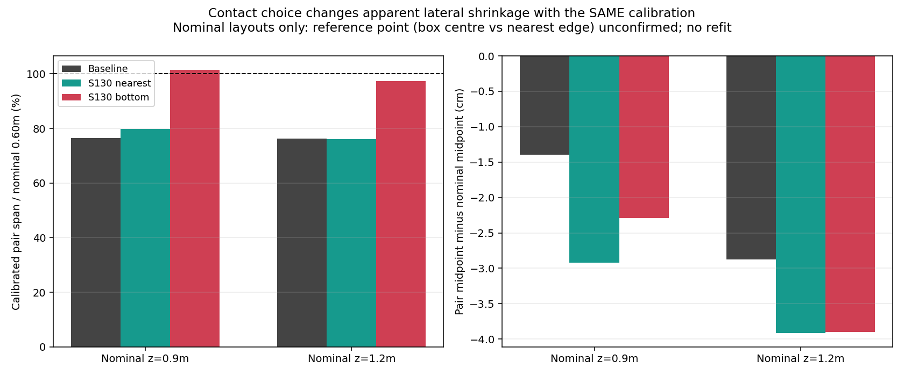
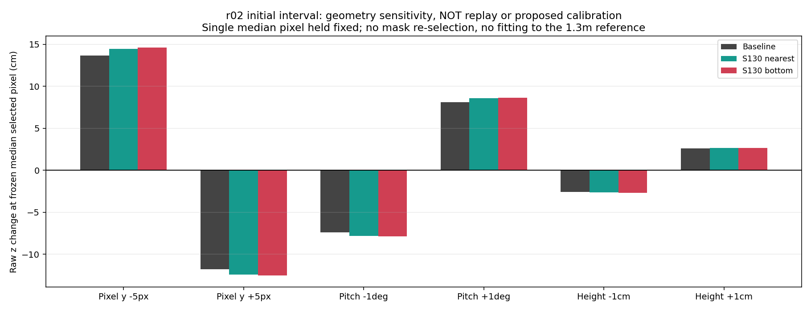

# 2026-10-06 接地点・距離校正の分離診断

## 結論

**現在の録画だけを根拠に、距離倍率やオフセットを変更するのは支持できない。接地点の定義、投影の幾何、配置ラベルの基準点を分離する必要がある。**

1. ground-contact経路は既存の座標変換と一致した。39 session/variant、21,297検出で保存値との差0、範囲ゲートの判定不一致0。古いBEV用の奥行き倍率を二重適用するような処理は、この経路にはなかった。
2. 同じ横位置補正でも、接地点を変えると左右間隔が名目60 cmの約76～80%から、底部中央値では約97～101%へ変わった。横方向の縮みを校正係数だけの問題と断定できない。
3. 08/26の配置は既存診断で`nominal_only`と扱われていた。箱中心／最近接端の確証がなく、今回も新しい係数の推定・採用には使用していない。
4. r02の初期1.3 mは、ユーザー確認により**カメラ直下・Kobuki中心からの距離**と記録した。車体前端からの測距による差という説明は外れるが、箱側の測定点、x/z成分は未確認。
5. 固定pixelの感度計算では、r02でpixel yの5 px差が約12～15 cm、pitchの1度差が約8 cmの奥行き差になる。これは原因候補の大きさを示すもので、pitch等が実際に間違っている証拠でも、採用する補正値でもない。

本番設定、距離校正、カメラ処理、追跡、TTC、FFB、relay、adapterは変更していない。新しい係数の学習、ROS送信、実機出力なし。安全ゲートも緩めていない。

## 現在の座標変換

`src/bird_eye.py`のground-contact分岐と、動画再計算用`OfflineBluePipeline.calibrate_contact`を確認した。

```text
画像輪郭 → レンズ光線 → カメラ高さの床面との交点(raw X, raw Z)
X = 0.607688741902197 × raw X + 0.022595727915692983 m
Z = raw Z + 0.0 m
範囲判定 → 面積・観測ゲート → 追跡 → TTC／衝突状態
```

- `blue_calibration_x_scale`、`blue_calibration_z_scale=1.389122`、`blue_calibration_z_offset_m=-0.296977`は旧BEV検出分岐の値。ground-contact分岐に適用されていない。JSONに残っていることと、現在使われていることは区別する。
- `car_offset_x=0.05`と`car_offset_z=0.09`は車体描画用の値で、実測したカメラ外部パラメータではない。床面投影へ加算しない。この9 cmを距離誤差への補正として戻していない。
- 上記の全39群の保存座標と、記録された各群の係数による再計算が完全一致した。範囲判定も一致。これはこの段階の変換整合の確認で、物理的な投影精度や処理全体の安全性の証明ではない。

根拠: [calibration_audit.csv](calibration_audit.csv)、`src/ground_contact.py`、`src/bird_eye.py`、`src/evaluate_raw_velocity_confidence_replay.py`。変換と範囲判定は既存結果だけで確認でき、新たな動画解析は不要だった。

## 接地点変更と横方向の縮み

左右の推定中央値の差を取ると、一定のxオフセットは打ち消される。したがって左右間隔の縮みは、オフセットだけを変えても直らない。

| 奥行きの名目値 | 接地点方式 | 校正後の左右間隔 | 名目60 cmとの比率 | 左右中点の名目位置との差 |
|---|---|---:|---:|---:|
| 0.9 m | baseline | 45.83 cm | 76.38% | −1.40 cm |
| 0.9 m | S130 nearest | 47.85 cm | 79.76% | −2.92 cm |
| 0.9 m | S130 bottom | 60.90 cm | 101.50% | −2.29 cm |
| 1.2 m | baseline | 45.75 cm | 76.25% | −2.88 cm |
| 1.2 m | S130 nearest | 45.70 cm | 76.17% | −3.91 cm |
| 1.2 m | S130 bottom | 58.37 cm | 97.28% | −3.90 cm |

係数は全方式共通。底部方式が横位置の別の代表点を選ぶこと自体で、縮みの見え方が変わる。現行の最近接輪郭点と、中央列の底部中央値は、同じ物理的な箱の点を必ず測るものではない。

`paired_lateral_spans.csv`には「名目60 cmに一致させる場合の見かけの倍率」も診断値として記録したが、これは名目値の比を出しただけで、係数フィット・採用候補ではない。baselineでは約0.796、bottomでは約0.599～0.625と方式で大きく変わり、現行0.607689を無条件に増やす根拠にはならない。



## 奥行きの変換と既存の独立データ

現行のZ補正は0 mなので、先行比較のZ誤差はそのまま床面投影・接地点の誤差を含む。別のBEV用係数を変更してもこの経路のZは変わらない。

既存の08/28横位置校正再診断で`trusted`として保存された点を再集計した。

| 過去の独立点群 | 点数 | 当時のbaseline X平均絶対誤差 | Z平均絶対誤差 |
|---|---:|---:|---:|
| 08/07 final holdout | 4 | 1.43 cm | 1.53 cm |
| 08/18 P0-A | 7 | 1.51 cm | 3.61 cm |

これは当時の各点の中央値に対する集計で、全frameを重み付けした平均やS130候補の再解析ではない。現在の候補と同じ画像・接地点の比較にも使わない。ただし、過去の比較的信頼できる配置では現行補正がより小さい誤差だったため、新しい名目配置の4点だけに合わせ直すことは慎重であるべき。

08/26名目配置ではZ推定が名目値より小さい一方、10/06 r02初期距離では推定距離が1.3 mより大きい。異なる日・配置・接地点で誤差の向きが一致しない。全条件へ一律の奥行きオフセットを加減する根拠はない。箱側の測定点と当日の物理的なカメラ姿勢も確証がなく、幾何誤差と定義差はまだ分離しきれていない。

根拠: [coordinate_decomposition.csv](coordinate_decomposition.csv)、[trusted_baseline_reference.csv](trusted_baseline_reference.csv)、[08/28診断](../../2026-08-28/2026-08-28_lateral_calibration_rediagnosis.md)。今回の参照区間はゲート採用前の全検出を含み、r02初期90 frameの不採用点を除いていない。

## 固定pixelによる幾何の感度

各参照区間の選択pixelの中央値を1点として固定し、既存のレンズ光線計算・床面投影を再利用してパラメータを一つずつ増減した。輪郭・マスクを再選択していない。中央値のpixelを投影した値は、選択された複数点の投影後中央値と一般には一致しない。

今回15参照区間のアンカーZと元のraw Z中央値の差は最大約1.04 cm。`coordinate_decomposition.csv`にその差も保存した。以下は真の処理経路再生や物理測定ではなく、局所感度の近似的な説明である。

r02初期区間のS130 bottomの例:

| 1項目だけ変える仮定 | アンカーraw Zの変化 |
|---|---:|
| 選択pixel y −5 px | ＋14.62 cm |
| 選択pixel y ＋5 px | −12.54 cm |
| pitch −1度 | −7.88 cm |
| pitch ＋1度 | ＋8.65 cm |
| カメラ高さ −1 cm | −2.67 cm |
| カメラ高さ ＋1 cm | ＋2.67 cm |
| frontレンズ中心y ＋1 px | ＋2.74 cm |
| frontレンズ中心y −1 px | −2.66 cm |

pixel yとレンズ中心yは相対位置に作用し、独立に一つの距離だけから識別できない。物理的な高さ・傾き・レンズ中心の測定なしに、1.3 mへ一致する値を逆算して設定に入れることはしていない。



## 実装・検証・保存物

- `src/diagnose_box_contact_calibration.py`: 座標変換と範囲判定の監査、raw／補正後の分解、左右間隔、幾何感度、既存独立点の集計。
- `tests/test_diagnose_box_contact_calibration.py`: 13 tests。旧BEV・描画offsetの非適用、座標／範囲判定不一致の検出、欠落・不採用点・名目値の扱い、カメラ高さによる比例、無効光線、元設定の不変更、左右差からoffsetが消えること等。
- `calibration_audit.csv`: 全39群の変換一致。
- `coordinate_decomposition.csv`: 名目4配置＋初期距離1区間×3方式のraw値、補正値、誤差、アンカーの近似差。
- `paired_lateral_spans.csv`: 6通りの左右間隔・中点。
- `geometry_sensitivity.csv`: 15区間×12変化=180行、無効投影を0変化として扱わない。
- `trusted_baseline_reference.csv`: 当時のbaseline独立点の参考集計。
- `provenance.json`: 入力CSV・参照区間・既存校正点・処理コードのSHA-256、適用範囲と制約。
- `create_diagnosis_assets.py`、`validation.json`: グラフ再生成とhash・監査結果の整合確認。

全体306 tests PASS（今回の13件を含む）。今回のコード・テスト・図生成スクリプトの構文チェックと`git diff --check`もPASS。既存のPyTorch/YOLO未導入警告は本診断へ影響しない。Matplotlibの3D環境警告はあるが2Dグラフは生成できた。

```bash
python3 src/diagnose_box_contact_calibration.py \
  --comparison-dir Experimental_results/2026-10-06/box_contact_validation/spatial_occlusion \
  --comparison-dir Experimental_results/2026-10-06/box_contact_candidates \
  --references Experimental_results/2026-10-06/box_contact_validation/position_references.csv \
  --trusted-points Experimental_results/2026-08-28/2026-08-28_lateral_calibration_points.csv \
  --output-dir Experimental_results/2026-10-06/box_contact_calibration_diagnosis

python3 Experimental_results/2026-10-06/box_contact_calibration_diagnosis/create_diagnosis_assets.py
```

再生・図の生成にカメラ／ハンコンは不要。保存済みframe集計とprovenanceを使うため、元動画の一時展開先が消えても本診断は再実行できる。

## 次に行うこと

1. 遮蔽ラベルの再点検は、後続作業で[旧完全遮蔽の全182 frame](../occlusion_label_review/README.md)まで完了。全て部分可視だったため、真の完全遮蔽性能は`NOT_EVALUATED`とした。次は別の既存UNKNOWN録画等で真の完全遮蔽を確認する。元ラベル・画像・候補設定は変更していない。
2. 実機採用に向けて、代表点の定義を固定する。距離はカメラ直下から箱の手前接地面、横位置は最近接端／中心のどちらを対象にするかを明示し、記録値・評価・将来のYOLO経路で一致させる。
3. その定義で実測・配置写真のある複数距離／左右条件を校正用と独立評価用に分ける。既存録画で不足する基準点だけを追加取得する。カメラ高さ・姿勢も測る。単一初期距離に合わせて複数パラメータを同時調整しない。
4. 校正と接地点候補を同時に本番へ変更せず、個別の精度・TTC・静止／遮蔽回帰とKobuki PCの処理時間を確認してから採用判断する。

今回の診断で校正係数を変更しない判断材料は増えたが、物理的な誤差原因を一つに確定した段階ではない。
