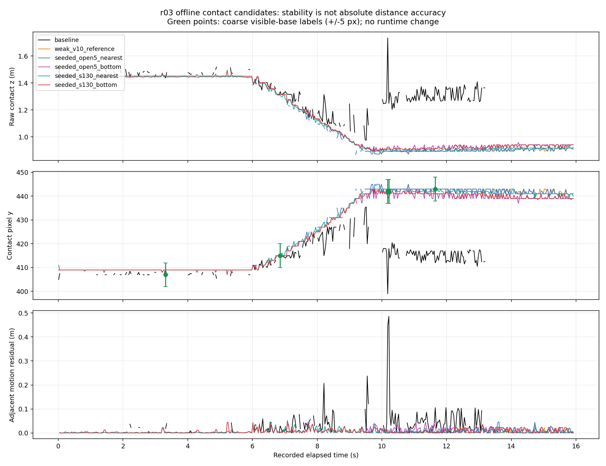
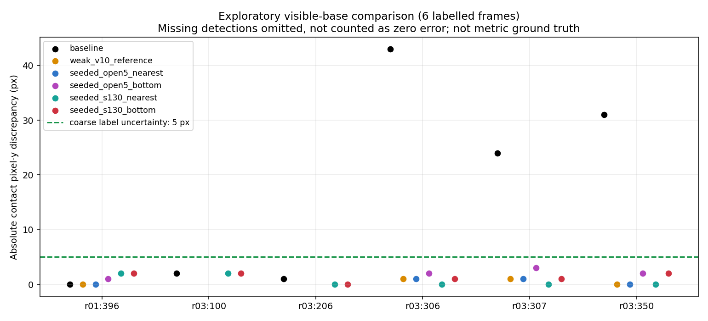

# 2026-10-06 箱本体の領域分離・底部接地点のオフライン比較

## 結論

**暗い青面の復元と高彩度領域の分離を組み合わせると、r03の保存動画上の検出欠落・停止後の距離急変は大幅に減った。実機への採用はまだ行わない。**

- 高彩度候補2方式でr03の動画検出は245/478から478/478 frameへ増加。停止後0.5秒以降も179/179 frameを検出・測定採用した。
- 同区間の隣接距離変化とODOMの不整合最大値は48.6 cmから、既存接地点選択を使う候補で2.6 cm、横幅の底部中央値を使う候補で3.6 cmへ減った。
- 箱なし対照853 frameでは高彩度候補の検出0、仮想通知0。低彩度のまま領域を分離する候補は6 frameで背景を拾うため、採用候補にしない。
- r03の代表画像3点で、既存接地点は目視の箱底部から24～43 px上にあった。高彩度候補は6点の可視底部ラベルすべてで0～2 px差だった。ただし目視ラベルは±5 px程度の粗い確認で、距離の実測正解ではない。
- 底部中央値は常に最良ではない。高彩度＋既存接地点選択のほうがr03の停止後は安定したが、r02の警告開始が動画baseline比0.933秒遅い。底部中央値はこの開始時刻を維持する一方、停止中のばらつきはやや大きい。

今回実装したのは**比較用のオフライン処理**。`bird_eye.py`、本番`ground_contact.py`、JSON設定、relay、adapter、FFB強度、安全ゲートは変更していない。ROS送信・実機駆動は行っていない。YOLO経路の実装や検証でもない。

## 背景と比較設計

[前段の品質診断](../ground_contact_quality_diagnosis/README.md)では、輪郭の欠損・入り組みと接地点の不安定さを確認した。単一の形状閾値ではr03の測定全体を失うため、今回は測定を捨てるゲートではなく、箱を表す領域を得る方法を比較した。

初期4方式の比較後、r03で明るさ下限を下げるだけでは背景との連結が増えることを確認し、高彩度候補2方式を追加して同じ7録画を再評価した。この順序と設定値の選択は探索的であり、独立holdoutとして扱わない。

| variant | 明るさ・領域処理 | 接地点 |
|---|---|---|
| `baseline` | 現行HSV、3×3 opening＋closing 2回 | 現行の近い輪郭点8% |
| `weak_v10_reference` | V下限だけ10に変更、他は現行 | 同上 |
| `seeded_open5_nearest` | V≥10、5×5 opening、明るいseedを要求、closingなし | 同上 |
| `seeded_open5_bottom` | 同上 | 中央約80%の各列の最下画素を投影し、X/Z中央値 |
| `seeded_s130_nearest` | 上記seed方式＋S下限130 | 現行の近い輪郭点8% |
| `seeded_s130_bottom` | 上記seed方式＋S下限130 | 各列の底部中央値 |

seed方式では、V≥30の領域を5×5 openingした明るい画素を、V≥10の各連結成分が100画素以上、かつ10%以上含むことを要求する。S130方式のseedもS≥130である。Hの範囲は既存値を維持する。5×5 openingは細い連結を分離する比較であり、太い連結を必ず切れるものではない。

全候補で現行の前方ROI、面積300 px以上、縦横比1.5以下を維持し、最大輪郭面積を選ぶ。高彩度候補は記録されたS下限より緩めない（`max(記録値, 130)`）。ROIを正解ラベルや前フレームの箱位置で指定せず、未来のフレームも使わない。

底部方式は実マスクの最下画素のみを使う。欠けた列・底面を補完せず、投影可能な列がサンプル列の半分未満なら未検出とする。狭い下向き突起に支配されにくくする狙いだが、広い反射や底面色の欠損には対応できない。

実装は既存OpenCVとNumPyのみ。連結成分・輪郭の扱いは[OpenCV公式](https://docs.opencv.org/4.x/d3/dc0/group__imgproc__shape.html)、openingによる小領域・細い接続の除去は[形態学処理の公式説明](https://docs.opencv.org/4.x/d9/d61/tutorial_py_morphological_ops.html)を参照した。これらは画像処理の根拠であり、箱の識別精度や安全性の保証ではない。

## 入力と再計算範囲

| 録画 | frame数 | 比較の役割 |
|---|---:|---|
| 10/06 hardware r01 | 650 | 既存の警告・停止を維持できるか |
| 10/06 hardware r02 | 479 | 同上、反射の指摘があった環境 |
| 10/06 hardware r03 | 478 | 床変更後の検出・距離不安定性 |
| 08/25 `hakonasi_20260825_131458_522` | 853 | 箱なしの背景抑制 |
| 09/08 `static_center_ttc_r01` | 622 | 静止時の不要通知 |
| 09/08 `retreat_center_v0p10_r01` | 647 | 後退時の不要通知 |
| 09/29 hardware UNKNOWN r01 | 1,301 | 遮蔽・UNKNOWN通知への影響 |
| 合計 | **5,030** | 6方式で30,180 frame行 |

- 検出設定だけをv12設定から適用し、カメラ幾何・校正・記録時刻・ODOM/CMD・追跡・TTC・衝突状態・cadenceの設定は各録画のmetadataを維持した。
- 各方式に独立した追跡器を用意し、検出→校正→観測ゲート→追跡→TTC→衝突状態→仮想FFBを再計算した。先行の視覚速度根拠確認候補は混ぜていない。
- CSVのframe連番、時刻の単調増加、記録された速度値、動画の長さと寸法を検査する。欠落frameを距離0として計算せず、隣接不整合も欠落を跨がない。
- 7 sessionのbaseline検出・距離は、同じ検出設定の前段結果と一致。6 sessionは前回動画再計算、古い箱なしは今回と同じ縦横比1.5を使った品質診断との一致を確認した。古い箱なしの記録設定は縦横比無制限であり、その旧動画再計算を同設定baselineとして混同していない。

## r03の検出・距離変化

以下は保存動画からの値。実機のライブCSVに直接適用した結果ではない。

| 方式 | 全478 frameの検出 | 全frameの測定採用 | 停止後179 frameの検出 | 停止後3 cm超の不整合 | 停止後最大不整合 |
|---|---:|---:|---:|---:|---:|
| baseline | 245 | 104 | 93 | 50/83ペア | 48.6 cm |
| V10のみ | 191 | 182 | 177 | 1/175ペア | 3.4 cm |
| seed＋opening／既存接地点 | 251 | 229 | 179 | 3/179ペア | 4.6 cm |
| seed＋opening／底部中央値 | 251 | 230 | 179 | 8/179ペア | 4.5 cm |
| S130＋seed／既存接地点 | **478** | **276** | **179** | **0/179ペア** | **2.6 cm** |
| S130＋seed／底部中央値 | **478** | **276** | **179** | **1/179ペア** | **3.6 cm** |

根拠: `contact_summary.csv`。停止後は最後の前進ODOMから0.5秒以降。ペアは現在frameの区間で分類するため、最初のframeは前区間末尾とのペアを含む場合がある。固定箱・直進前提の`abs(z[t]-z[t-1]+平均ODOM速度×dt)`であり、絶対距離誤差ではない。

V10のみは停止後を改善しても前半で背景と箱がつながり、全体の検出率を落とす。S130候補はこの録画で欠落を解消するが、暗く低彩度の別の箱・別の照明では見落とす可能性がある。



停止後のraw z中央値はbaseline 1.299 m、高彩度の既存接地点0.907 m、底部中央値0.918 mと大きく変わる。画像の箱底部との整合は改善したが、r03には実測初期・停止距離が提供されていない。**安定した0.91 mを正確な距離と認定していない。**

## 目視位置による確認

無加工PNGを見て、箱全体の粗いbboxと、可視底部の代表yを記録した。`coarse_image_labels.csv`は探索用の人手ラベルで、精密な輪郭、魚眼投影の正解、物理距離の正解ではない。ラベルを候補の検出処理へ入力していない。箱の底辺の傾き・白い上面・陰影を含むため、底部yの不確かさを±5 pxとする。

| 画像 | baselineの底部y差 | S130既存接地点 | S130底部中央値 |
|---|---:|---:|---:|
| r01 frame 396 | 0 px | 2 px | 2 px |
| r03 frame 100 | 2 px | 2 px | 2 px |
| r03 frame 206 | 1 px | 0 px | 0 px |
| r03 frame 306 | **43 px** | 0 px | 1 px |
| r03 frame 307 | **24 px** | 0 px | 1 px |
| r03 frame 350 | **31 px** | 0 px | 2 px |

r03の粗いbboxとのIoUはbaseline約0.28～0.45、高彩度候補約0.78～0.83だった。ただしこれは箱全体の目視bboxとマスクbboxの比較であり、pixel単位の正解マスクとの一致率ではない。r02 frame 350は底部が車体に一部隠れるためbboxだけを記録し、底部y誤差には使用しない。



既存の無加工画像5枚を再利用し、r02 frame 350、r03 frame 100を1280×720の無加工PNGとして追加した。全7枚を元動画の該当frameと全画素照合した。注釈、合成、切り抜き、リサイズ、色・明るさ補正なし。保存場所・hashは`raw_assets_manifest.csv`。

## 警告と遮蔽への影響

| session | 動画baseline WARNING／UNKNOWN frame | S130既存接地点 WARNING／UNKNOWN | S130底部中央値 WARNING／UNKNOWN | 仮想active時間窓数 baseline→各S130 |
|---|---:|---:|---:|---|
| r01 | 22／0 | 22／0 | 21／0 | 3→3、3 |
| r02 | 55／0 | 27／0 | 55／0 | 3→3、3 |
| r03 | 0／34 | 0／0 | 0／0 | 1→0、0 |
| 箱なし・静止・後退 | 各0／0 | 各0／0 | 各0／0 | 各0→0、0 |
| 09/29 UNKNOWN対照 | 266／64 | 275／59 | 275／59 | 7→7、7 |

根拠: `risk_summary.csv`。全方式・全sessionでCRITICALは0。時間窓数は連続active区間の数であり、独立した警告イベント数や実際に感じた振動数ではない。09/29対照にはWARNING_HOLDもあり、baseline 33、高彩度候補31 frame。

r02の最初のWARNINGは、動画baseline 8.257886秒、高彩度既存接地点9.190538秒、底部中央値8.257886秒。高彩度既存接地点は0.932652秒遅くなる。ライブ記録の開始時刻も9.190538秒であり、これだけで実機の応答遅延を証明する値ではないが、方式選択が警告タイミングへ影響することは明確である。

r01の最初のWARNINGは全方式12.389616秒で一致した。r03の候補はWARNINGを再現したのではなく、画像の欠損に由来するUNKNOWNと距離急変を減らした。r03は実速度が約0.126 m/sと遅く、今回警告0になったことを見逃しとも成功とも判定しない。低速・真の高速接近に対する応答は別途確かめる必要がある。

09/29遮蔽対照は高彩度候補で検出784→853、採用763→772 frameと変化する。追加69検出を「正しい認識復帰」と扱う正解ラベルはない。通知窓数が維持されても、部分遮蔽時に別領域を拾っていないかを少数画像で追加確認する必要がある。

## 本番採用を保留する理由

追記: 設定・候補本体を固定した[左右・遮蔽・接近の回帰検証](../box_contact_validation/README.md)を実施した。動的TTC評価は候補2方式で6/6件PASSだったが、左0.9 mの奥行き誤差とr02の初期1.3 mに対するゲート前の距離偏りが増えた。以下の探索段階の未検証事項は同レポートで更新し、本番採用は引き続き保留する。

1. 本比較はr03の問題を見て設計した探索。独立した距離・横位置・遮蔽条件での検証が未実施。
2. 高彩度の青い箱に限定する色条件であり、物体の意味的な識別ではない。YOLO等の対象領域・セグメンテーション経路を置き換える完成実装ではない。
3. 既存接地点と底部中央値には、停止中の安定性とr02警告開始時刻のトレードオフがある。底部中央値を無条件で優先しない。
4. 安定した距離には定常偏りが残り得る。r02の実距離1.3 mは**初期距離**であると実施者へ再確認済みで、停止後距離の正解値ではない。カメラ幾何の誤差や床面の違いを含め、実測位置のあるデータで確認する必要がある。
5. 解析PC・単一thread・逐次比較で、検出処理中央値はbaseline約6.5 ms、高彩度候補約16 ms。これには追跡・GUI・ROS等が入らず、Kobuki PCで30 fpsを維持できる証明ではない。
6. 保存MJPGとライブ画素の違い、ネットワーク・challenge・物理出力の検証は本比較の範囲外。

## コード・保存物・検証

- `src/offline_box_contact_candidates.py`: 色のseed、連結成分、領域選択、底部中央値。実機からimportしていない。
- `src/compare_offline_box_contacts.py`: 動画・記録運動から6方式を同条件で再計算するCLI。
- `tests/test_offline_box_contact_candidates.py`: 19 tests。暗い領域単独の拒否、細い背景接続の分離、横長床・前方ROI外の拒否、低彩度除外、下向き光線・列数の検査、既存幾何との一致、欠落を跨がない残差等。
- `frame_results.csv`: 30,180行、接地点・bbox・ゲート・追跡・TTC・衝突状態・仮想通知・時間計測。
- `contact_summary.csv`、`risk_summary.csv`: 全体・区間別の比較。
- `coarse_image_labels.csv`、`coarse_label_comparison.csv`: 少数画像の位置ラベルと比較値。
- `baseline_integrity.csv`: 同じ設定の前段結果との7 session一致確認。
- `provenance.json`: 全入力・実装SHA-256、固定候補設定・比較上の制約。
- `raw_assets_manifest.csv`、`validation.json`: 無加工PNGと元frameの照合、baseline一致、runtime未変更・実機未承認。
- `create_comparison_assets.py`: 根拠CSVから2グラフ・位置比較・検証結果を再生成。

ROS Humbleと`oit_interfaces`を読み込んだ全体**279 tests PASS**。構文チェック・`git diff --check` PASS。PyTorch/YOLOは未導入だが、今回の候補はそれらへ依存しない。Matplotlibの3D拡張の環境警告は出るが、今回の2Dグラフ生成・目視確認は完了した。

## 再現コマンド

```bash
python3 src/compare_offline_box_contacts.py \
  --input /path/to/r01 \
  --input /path/to/r02 \
  --input /path/to/r03 \
  --input /path/to/hakonasi_20260825_131458_522 \
  --input /path/to/static_center_ttc_r01 \
  --input /path/to/retreat_center_v0p10_r01 \
  --input /path/to/phase5_v12_hardware_unknown_r01 \
  --detector-config src/bird_eye_config_ttc_v12_ffb_reliability_20260929.json \
  --output-dir Experimental_results/2026-10-06/box_contact_candidates

python3 Experimental_results/2026-10-06/box_contact_candidates/create_comparison_assets.py
```

CLIはmetadata・detections.csv・raw.aviのある展開済みsessionまたは親ディレクトリを受け取る。結果フォルダだけからは動画を読めない。資料生成はprovenance内の元動画と前段の動画再計算・品質診断を必要とするため、別PCでは入力パスを対応させ、前段解析も再実行すること。

## 次に進める作業

1. 候補の設定を固定したまま、今回未使用の距離・左右位置ラベル付き過去録画で、検出率と距離偏り・警告タイミングを比較する。閾値調整用と評価用を分ける。
2. 09/29対照の追加検出69 frameを、部分遮蔽／別物体／認識復帰に切り分ける。速度と時刻だけで正解を与えない。
3. 既存接地点と底部中央値を比較した根拠が揃ってから、実機候補を選ぶ。runtime変更・実機試験はその影響を説明して承認後に進める。

追加録画なしで、箱本体に近い領域と底部を選ぶ候補を実装・比較するところまで完了した。実機設定を緩和して成功扱いにはしていない。
