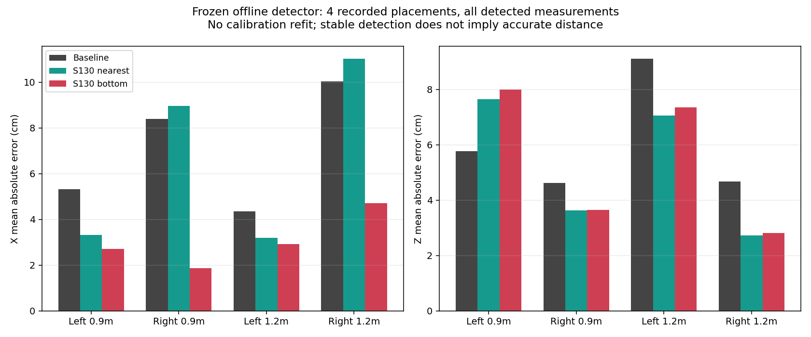
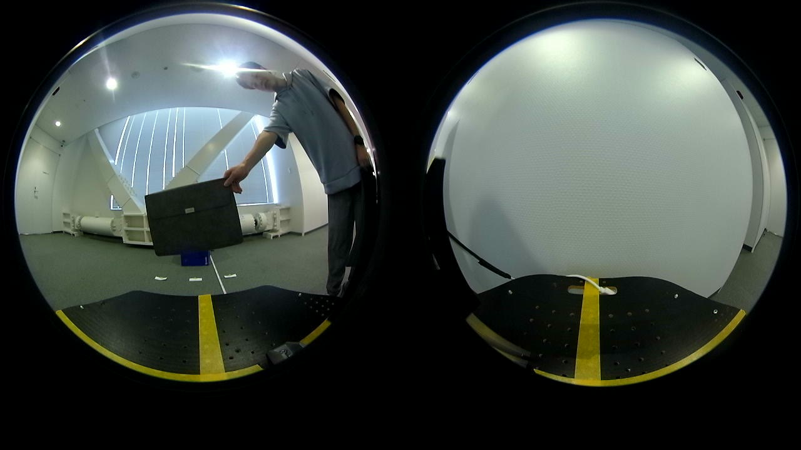
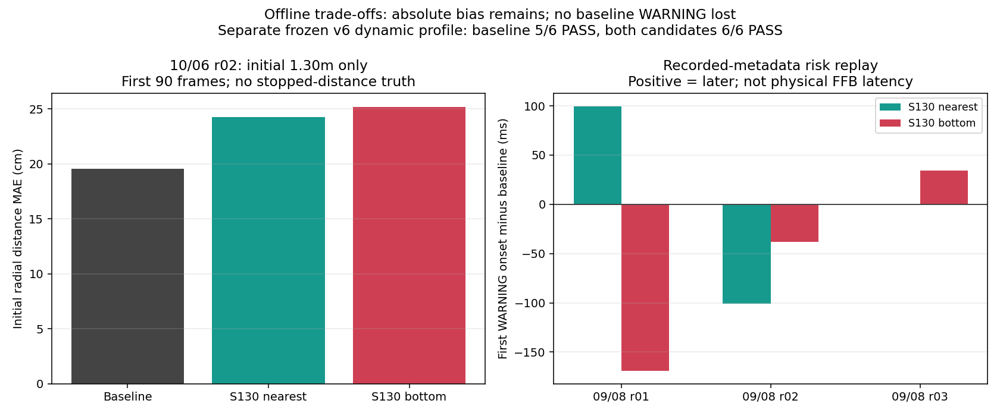

# 2026-10-06 固定した箱領域・接地点候補の回帰検証

## 結論

**接近時の追跡・警告を維持できる候補は確認できた。ただし絶対距離の偏りが残るため、本番採用・校正値の変更は保留する。**

- 既存v6動的TTC評価条件を変更せず適用すると、baselineは5/6件PASS、高彩度候補2方式はそれぞれ6/6件PASS。
- 左右4配置すべてで検出100%。底部中央値は横位置誤差を減らしたが、左0.9 m配置の奥行き誤差は増えた。
- 過去ラベルの完全遮蔽182 frameでは、全方式で測定採用0。3イベントとも追跡を失い、箱の再出現後に復帰した。ただし候補の生検出は8→13 frameに増えた。代表画像ではラベルと異なり箱の一部が見えており、この増加をすべて誤検出と扱うことも、完全遮蔽の安全性検証が完了したと扱うこともできない。
- r02の実距離1.3 mはユーザー確認済みの**初期距離**としてのみ使用した。初期90 frameの距離誤差はbaseline約19.6 cm、候補約24.3／25.2 cmであり、安定性の改善を絶対精度の改善とは扱わない。
- 本番カメラ処理、JSON設定、FFB送信、relay、adapter、強度、安全ゲートは変更していない。ROS送信・実機駆動なし。

## 比較の固定条件

[探索比較](../box_contact_candidates/README.md)で得た設定・候補本体のSHA-256を固定し、今回の結果を見て閾値を調整していない。CLIに`--variants`と`--freeze-from`を追加し、baselineとS130候補2方式のみを再計算できるようにした。候補本体のコード・設定の不一致はエラーにする。

| variant | 領域 | 接地点 |
|---|---|---|
| `baseline` | 現行HSVと形態学処理 | 現行の近い輪郭点8% |
| `seeded_s130_nearest` | V下限10、S下限130、opening 5、明るいseed100画素以上かつ10%以上 | 現行の近い輪郭点8% |
| `seeded_s130_bottom` | 同上 | 中央約80%の各列の実最下画素を投影しX/Z中央値 |

検出設定だけv12から適用する。カメラ幾何、距離校正、記録時刻、ODOM/CMD、追跡・観測ゲート、TTC・衝突状態、cadenceは各録画のmetadataを維持する。08/26録画の正規化面積下限2000も維持し、現在の1450へ変更していない。別途開発した視覚速度の根拠確認候補は混ぜていない。

全方式のbaselineには現在の縦横比上限1.5が適用される。古いライブ設定や古い解析で縦横比が無制限だった結果とは、同一baselineとして比較しない。保存MJPG画像の再計算であり、ライブ画素・物理振動の完全再現でもない。

## 入力

| 元アーカイブ／session群 | session数 | 動画frame数 | 役割 |
|---|---:|---:|---|
| `Downloads/recoding/202608261410.tar.xz` | 6 | 4,491 | 箱なし、左右±0.30 m×奥行き0.9/1.2 m、中央1.2 mの遮蔽 |
| `202609081440.tar.xz`の`approach_center_v0p10_r01`～`r03` | 3 | 1,832 | 約0.10 m/s接近 |
| `202609081640.tar.xz`の`approach_center_v0p20_r01_v6holdout`～`r03` | 3 | 1,880 | 約0.20 m/s接近、`omake`除外 |
| 前段の10/06 hardware r02結果 | 既存結果再利用 | 初期90のみ | 初期1.3 mとの比較、動画の再解析なし |

新規動画再計算は12 session、8,203 frame、3方式で24,609行。全入力の動画・CSV・metadata hash、適用設定は`spatial_occlusion/provenance.json`と`approach/provenance.json`に記録した。一時展開先は永続保管場所ではないため、再実行時は元アーカイブから安全に再展開する。

これは過去に他の解析でも使った研究データであり、前向きに収集した盲検holdoutではない。今回の候補設計に使用したr03とは異なる配置・接近録画で、設定固定後の回帰を確認したもの。

## 左右・距離の名目配置との比較

既存配置記録を`position_references.csv`へ明示した。位置誤差は校正適用後、ゲート採用前の**全検出**を対象にする。不採用点を除いてよい値だけにすることも、未検出を誤差0とすることもない。8月28日の既存診断で08/26録画は`nominal_only`として扱われており、配置写真・箱中心／最近接端の基準点の確証がない。以下は名目配置値との整合を調べる参考値で、校正係数の学習・採用判断には使わない。

値は平均絶対誤差（MAE）、単位cm。`nearest`と`bottom`はS130候補。

| 配置 x,z (m) | baseline X／Z | nearest X／Z | bottom X／Z |
|---|---:|---:|---:|
| −0.30, 0.90 | 5.32／5.77 | 3.32／7.64 | 2.70／7.99 |
| ＋0.30, 0.90 | 8.40／4.61 | 8.97／3.63 | 1.87／3.65 |
| −0.30, 1.20 | 4.36／9.10 | 3.19／7.05 | 2.93／7.34 |
| ＋0.30, 1.20 | 10.04／4.67 | 11.02／2.73 | 4.72／2.81 |

全配置・全方式で検出100%、測定採用99.84～99.86%（追跡初期化の1 frameを除く）。底部中央値は左右非対称の横位置誤差を減らすが、nearestは右側で横位置誤差を増やした。左0.9 mの奥行き誤差は両候補で増える。単一の距離オフセットで直ると判断せず、接地点・投影・既存校正を分離して次に診断する。

根拠: [position_accuracy.csv](position_accuracy.csv)、[phase_results.csv](phase_results.csv)。



## r02 初期1.3 mの扱い

前進開始前のframe 1～90だけを対象にした。停止後や移動中の距離の正解として1.3 mを使用していない。ユーザーから距離の起点は**カメラ直下・Kobuki中心**と確認した（2026-10-06）。車体前端から測ったための差とは扱わない。x,z内訳と箱側の厳密な測定点は未確認なので、正面配置の「箱との距離」を暫定的に平面距離`hypot(x,z)`と比較し、x,zの正解欄は空欄にした。

| 方式 | 初期距離推定中央値 | 1.3 mとのMAE | 検出／測定採用 |
|---|---:|---:|---:|
| baseline | 1.497 m | 19.6 cm | 90／0 |
| S130 nearest | 1.542 m | 24.3 cm | 90／0 |
| S130 bottom | 1.552 m | 25.2 cm | 90／0 |

この区間は全方式で`calibration_range_gate`により測定不採用。上表は**採用された追跡距離ではなく、ゲート前の推定値**である。候補が定常偏りを4.7～5.6 cm増やす事実を、採用点だけの集計で隠していない。停止位置の正解、実測初期距離からODOMを積分して作った仮定の正解は追加していない。

## 遮蔽・復帰

既存の08/26位相ラベルは動画の0始まり・両端を含む番号。比較CSVのframeは1始まりなので、`video_index = frame − 1`で対応させる。ラベル欠落・範囲外・frame抜けはエラーにし、自動的に可視扱いにしない。

| 項目 | baseline | S130 nearest | S130 bottom |
|---|---:|---:|---:|
| 完全遮蔽ラベルframe数 | 182 | 182 | 182 |
| 同区間の生検出 | 8 | 13 | 13 |
| 同区間の測定採用 | **0** | **0** | **0** |
| 追跡喪失／再出現後復帰 | 3／3イベント | 3／3 | 3／3 |
| 遮蔽開始＋0.25秒後のtrack残存 | 0 frame | 0 | 0 |
| event 1 復帰遅れ | 0.241秒 | 0.241秒 | 0.241秒 |
| event 2 復帰遅れ | 0.520秒 | 0.520秒 | 0.520秒 |
| event 3 復帰遅れ | 0.192秒 | 0.124秒 | 0.124秒 |

復帰はreappearing開始から、測定採用とtrack利用可能が両方成立するまで。短いreappearingラベルの終端だけで打ち切らず、次の遮蔽の前まで調べる。記録時刻で遅れを算出し、一定FPSを仮定してframe数を秒へ換算していない。

安定可視698 frameでは、全方式で検出698、採用697。完全遮蔽中の候補は開始直後に予測trackが1 frame残るが、記録の猶予0.25秒を超えて残らない。生検出が増えるため、**背景除去そのものを成功・安全保証とは判定しない**。ラベルは既存の人手区間で、pixelごとの完全遮蔽正解ではない。

無加工画像のframe 431（動画index 430）を目視確認すると、遮蔽板の下に青箱の一部が見える。候補のbbox `(288,396,45,30)`はその可視部分に対応し、`normalized_area_gate`で不採用となった。続けて[13検出すべてを目視確認](../occlusion_label_review/README.md)し、すべて箱下部が一部見えていた。既存ラベルは変更せず、上表は**既存ラベルに対する集計**として保存した。残り169 frameは未確認で、検出点のみの追加レビューを全区間の再ラベル付けやfalse-positive率の独立評価とは扱わない。

**後続作業で[旧完全遮蔽の全182 frameを目視確認](../occlusion_label_review/README.md)した。182/182が部分遮蔽で、真の完全遮蔽は0 frameだった。** 上の未確認169 frameは初回時点の状態。旧ラベル・上表・本フォルダの集計は履歴として保存し、再分類した集計を`../occlusion_label_review/full_review_*`へ分けた。完全遮蔽の検出率／測定採用率は評価対象がないため`NOT_EVALUATED`（率は空欄）とし、0%・合格とは扱わない。3イベントの追跡喪失／復帰も真の完全遮蔽応答の証明には使用しない。



追加の箱なし818 frameは全方式で検出0、測定採用0、仮想通知0。前段の箱なし853 frameとは別の録画である。

根拠: [occlusion_events.csv](occlusion_events.csv)、[labelled_frames.csv](labelled_frames.csv)、`spatial_occlusion/contact_summary.csv`と`risk_summary.csv`。

## 接近と警告タイミング

録画metadataの衝突判定条件を維持した再計算では、0.10 m/sの3録画でWARNINGは全方式0。baselineのUNKNOWNはr02に1 frame、r03に10 frameあり、候補は0。これを実測TTCの正解なしに「低速の警告見逃しがない」とは認定しない。

0.20 m/s v6録画の最初のWARNING開始時刻は以下。正の差はbaselineより遅い。

| 録画 | baseline開始 | nearest差 | bottom差 |
|---|---:|---:|---:|
| r01 | 7.088931秒 | ＋99.4 ms | −168.8 ms |
| r02 | 5.021335秒 | −100.6 ms | −38.3 ms |
| r03 | 8.991454秒 | 0 ms | ＋34.5 ms |

baselineで発生したWARNINGを失うケースは0。3録画とも仮想active時間窓は全方式3、全6接近録画の最終状態はCLEAR、CRITICALは0。active時間窓数は独立した警告数・実際に感じた振動回数ではない。これらの開始時刻差はオフライン認識・判定の差であり、ネットワーク遅延や物理FFB遅延ではない。

### 固定v6動的TTC評価を別途適用

既存`dynamic_ttc_evaluation_profile_v6_candidate.json`を変更せず使用した。実速度が一定でない録画を新しい厳密速度基準で除外せず、既存profileの許容範囲を維持した。

| 方式 | PASS | FAIL | 主な差 |
|---|---:|---:|---|
| baseline | 5/6 | 1/6 | 0.20 m/s r02の動作中track率89.22%が基準95%未満 |
| S130 nearest | 6/6 | 0/6 | 上記track率100% |
| S130 bottom | 6/6 | 0/6 | 上記track率100% |

動的profileは独自の固定判定条件を持つため、metadata条件で作った警告開始時刻表とは**別の判定系列**。両者を混ぜてPASS理由を作らない。PASSは既存profileの条件を満たす意味で、実測距離の正確さや物理FFBの安全性を保証しない。

根拠: [warning_comparison.csv](warning_comparison.csv)、[fixed_dynamic_profile_results.csv](fixed_dynamic_profile_results.csv)。



## 保存物と検証

- `src/compare_offline_box_contacts.py`: 選択方式の再計算、固定した候補条件・コードの一致確認。
- `src/evaluate_box_contact_validation.py`: 配置誤差、位相ラベル、遮蔽復帰、警告比較、既存動的profileの集計。
- `position_references.csv`: 4配置とr02初期距離のみの参照区間。
- `spatial_occlusion/`、`approach/`: 各frame結果・集計・全入力hash・候補固定確認。
- `evaluation_provenance.json`: 集計入力・profile・集計コードのhash、ラベル番号の定義、制約。
- `create_validation_assets.py`: 根拠CSVから2グラフと無加工PNGを再生成。移動した録画にも元動画hash一致を要求。
- `raw_assets_manifest.csv`: session、frame、記録時刻、動画／PNG hash、元解像度・全画素一致。
- `validation.json`: hash整合、主要集計、実機未変更の記録。

関連21＋12 tests、ROS環境を読み込んだ全体**293 tests PASS**。frame番号対応、範囲外拒否、未検出を0誤差にしないこと、未復帰、ゲート不採用点の誤差、警告喪失の検出等を検証した。PyTorch/YOLOは未導入だが本比較には不要。Matplotlibの3D拡張に環境警告が出るが、使用した2Dグラフは生成済み。

追加したコードと生成スクリプトの構文チェック、`git diff --check`もPASS。

無加工PNGは[日付別画像フォルダ](../report_assets/README.md)へ保存する。実験風景の画像は元の1280×720を維持し、注釈、切り抜き、合成、リサイズ、色・明るさ補正なし。判定マスクを重ねた画像は作っていない。

## 再現

動画比較は安全に展開したsessionディレクトリを指定する。左右・遮蔽群は上表の6 session、接近群は上表の指定6 sessionのみ（`omake`等を入れない）。

```bash
python3 src/compare_offline_box_contacts.py \
  --input /path/to/extracted/selected_sessions \
  --detector-config src/bird_eye_config_ttc_v12_ffb_reliability_20260929.json \
  --variants baseline seeded_s130_nearest seeded_s130_bottom \
  --freeze-from Experimental_results/2026-10-06/box_contact_candidates/provenance.json \
  --output-dir Experimental_results/2026-10-06/box_contact_validation/spatial_occlusion
```

`--input`は複数回指定可能。接近6 sessionは別出力`approach`にする。入力が違えばhash・結果も再記録される。候補本体を変更した場合、固定条件との不一致を解決せずこの検証を再利用しない。

```bash
python3 src/evaluate_box_contact_validation.py \
  --comparison-dir Experimental_results/2026-10-06/box_contact_validation/spatial_occlusion \
  --comparison-dir Experimental_results/2026-10-06/box_contact_validation/approach \
  --comparison-dir Experimental_results/2026-10-06/box_contact_candidates \
  --position-labels Experimental_results/2026-10-06/box_contact_validation/position_references.csv \
  --phase-labels Experimental_results/2026-08-26/2026-08-26_raw_ground_distance_holdout_labels.csv \
  --dynamic-profile src/dynamic_ttc_evaluation_profile_v6_candidate.json \
  --output-dir Experimental_results/2026-10-06/box_contact_validation

python3 Experimental_results/2026-10-06/box_contact_validation/create_validation_assets.py \
  --recording-root /path/to/safely_extracted/202608261410
```

## 次に進む対象

1. オフラインで、現在の校正と各接地点の対応を再診断する。左右配置の偏り、r02の初期距離、カメラ／車体／箱底部の測定基準点の違いを分離する。
2. 新しい校正が必要と判断した場合も、候補検出器と同時に変更せず、既知配置の学習・検証を分けて比較する。停止距離の未提供値を正解にしない。
3. 遮蔽ラベルを元画像から点検し、完全遮蔽と箱の一部が見える区間を区別する。
4. 実機採用前にKobuki PCで候補の処理時間・30 fps維持と、実測距離のある条件での回帰を確認する。

現段階で追加録画やハンコン操作は不要。次のオフライン診断までは過去録画で進められる。本レポートは実機採用の承認ではない。

追記: [接地点と校正の分離診断](../box_contact_calibration_diagnosis/README.md)まで進めた。39 session/variantの21,297検出について既存座標変換・範囲ゲートとの一致を確認し、横方向の縮みと固定pixelの幾何感度を整理した。診断段階でも本番係数は変更していない。
