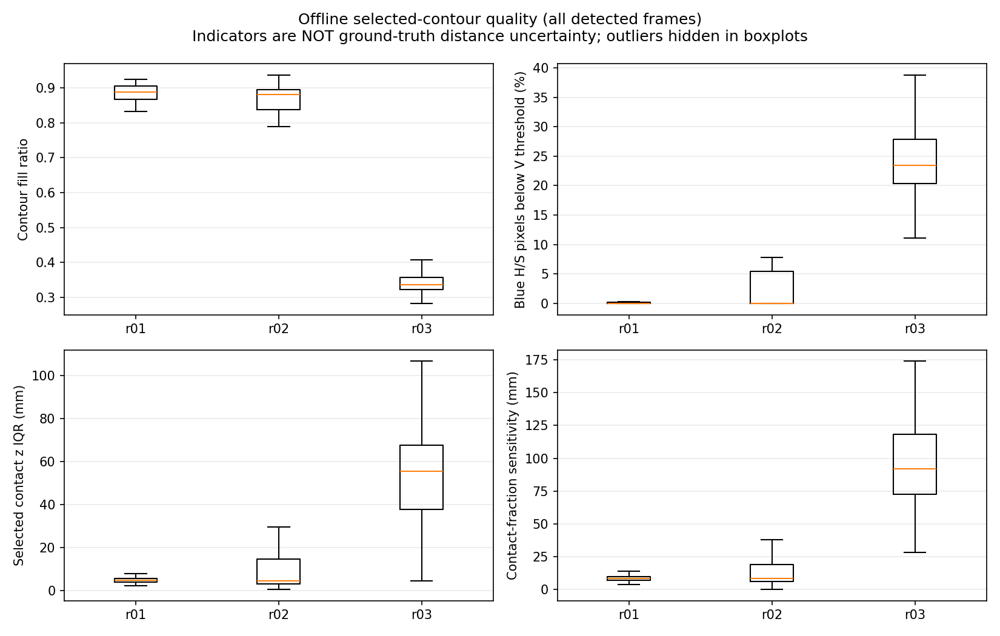
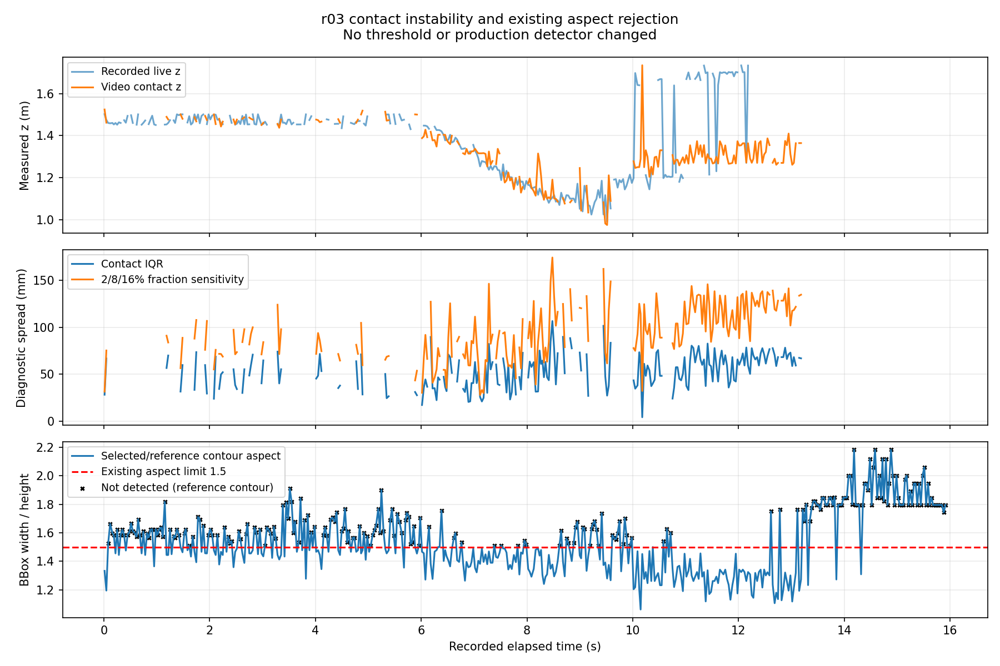

# 2026-10-06 青輪郭・接地点の品質診断

## 結論

**r03は、青輪郭の形状と接地点の選択が不安定である。品質情報を記録・比較できる診断ツールを追加したが、単一閾値で悪い測定だけを除ける結果ではない。**

- r03の未検出233/478 frameは、保存動画上ではすべて「前方ROI・面積条件を通る輪郭があるが、縦横比1.5で全候補が除外される」状態だった。
- 検出された輪郭の塗りつぶし率中央値はr01 88.9%、r02 88.1%、r03 33.7%。r03は凸包に対する面積比も低く、選ばれた輪郭が大きく欠ける／入り組む傾向がある。
- 接地点のz方向の広がり中央値はr01約4.7 mm、r02約4.6 mm、r03約55.4 mm。近い輪郭点の選択割合を2/8/16%に変えたときのz差もr03で大きい。
- ただし、r03の小さい時間変動と大きい時間変動はこれらの指標で重なる。広がりが小さいのに距離が大きく飛ぶ例もある。

輪郭・接地点の品質は距離不安定性の有力な手掛かりだが、真の箱輪郭や距離精度を保証するものではない。暗い青面の欠損や箱以外の領域の混入が寄与する可能性はあるが、反射だけを原因と断定していない。床変更後の録画であることも維持して解釈する。

本番検出器、追跡器、FFB、JSON、安全ゲートは変更していない。測定の新しい採否ゲートやROS出力も追加していない。

## 入力と検証範囲

- 10/06実走行hardware r01、r02、r03: 650、479、478 frame。
- 08/25箱なし`hakonasi_20260825_131458_522`: 853 frame。
- 計4 session、2,460 frame。元動画・CSV・metadataのSHA-256、入力パスは`provenance.json`に保存した。
- `src/bird_eye_config_ttc_v12_ffb_reliability_20260929.json`からHSV、縦横比、接地点割合等の検出設定だけを使用した。カメラ幾何は各録画のmetadataを維持した。旧箱なしも今回の縦横比1.5条件で比較した。

画像はMJPGとして保存済みの動画であり、ライブ画素の完全再現ではない。r03のライブ欠落理由を今回の動画から断定しない。[動画／ライブ再現性の比較](../raw_velocity_confidence_candidate/README.md)も併せて参照すること。

## 診断項目

追加コード: `src/diagnose_ground_contact_quality.py`。本番の`detect_blue_ground_contact`が返すマスクと接地点を使用し、診断用に輪郭を調べる。

| 項目 | 定義と注意 |
|---|---|
| 縦横比、塗りつぶし率、solidity | bbox幅／高さ、輪郭面積／bbox面積、輪郭面積／凸包面積。bboxは正解の箱領域ではない。 |
| 暗い青候補の割合 | 選択輪郭のbbox内でH/S条件を満たす画素のうち、V下限を下回る割合。箱外の画素も含み得る。 |
| 接地点z IQR | 既存方式が選ぶ近い輪郭点のz分布の75–25百分位幅。距離誤差の信頼区間ではない。 |
| 接地点割合の感度 | 同じ輪郭を2/8/16%で評価したz中央値の最大−最小。本番の8%設定は変更しない。 |
| 時間方向の変化 | 隣接検出frameのbbox IoU、面積差、接地点pixel移動。欠落frameを跨いで計算しない。 |
| ODOMとの距離変化不整合 | `abs(z[t] - z[t-1] + 平均ODOM速度 × dt)`。固定箱・直進の試験前提による参考値で、正解距離誤差ではない。 |

形状指標は既存の`contour_shape_features`を再利用した。定義は[OpenCV公式のContour Properties](https://docs.opencv.org/4.x/d1/d32/tutorial_py_contour_properties.html)に対応する。

未検出時にも、縦横比除外前の最大面積の前方輪郭があれば形状を記録するが、`feature_contour_role=pre_aspect_reference`と明示する。これは検出成功として数えず、接地点・距離の欄は空欄にする。

接地点分布の診断は既存幾何・点選択を再現し、本番が選ぶ中央値と各検出frameで一致することをassertで確認した。また10/06の3 sessionは前回の動画再計算に対し検出フラグ・zが全frame一致した（z差最大0）。

## 検出された輪郭だけの比較

未検出時の参考輪郭を混ぜない集計である。

| 指標の中央値 | r01（650検出） | r02（479検出） | r03（245検出） |
|---|---:|---:|---:|
| 塗りつぶし率 | 88.9% | 88.1% | 33.7% |
| solidity | 0.970 | 0.970 | 0.505 |
| bbox内の暗い青候補割合 | 0.0% | 0.0% | 23.5% |
| 接地点z IQR | 4.7 mm | 4.6 mm | 55.4 mm |
| 接地点割合2/8/16%のz差 | 8.3 mm | 8.5 mm | 92.2 mm |

根拠: `selected_contour_summary.csv`。箱の素材・照明・背景の違いも含む3録画であり、指標の差を普遍的な測定品質スコアへそのまま置き換えない。



## 停止後の不安定さ

停止後0.5秒以降は次のとおり。停止直後の過渡区間は除いた。

| 試行 | 対象frame | 動画検出 | 隣接検出・ODOM参照ペア | 3 cm超の不整合 | 最大不整合 |
|---|---:|---:|---:|---:|---:|
| r01 | 242 | 242 | 242 | 0 | 5.1 mm |
| r02 | 169 | 169 | 169 | 0 | 28.2 mm |
| r03 | 179 | 93 | 83 | 50 | 485.6 mm |

根拠: `quality_summary.csv`、`frame_quality.csv`。ペアは現在frameの区間で分類するため、区間最初のframeは前区間末尾とのペアを含む場合がある。検出欠落を距離0 mとして計算していない。



停止中にもr03の距離系列は大きく変わる。低FPSや実前進だけでは説明できない。一方、ODOMとの不整合は旋回や接地点が物体表面で移る影響を完全に補正した値ではない。特に走行中の3 cm超をすべて「誤測定」とラベル付けしない。

## 小さい接地点の広がりでも誤った点を選べる

| r03 frame | 時刻 | 動画推定z | 接地点pixel y | z IQR |
|---|---:|---:|---:|---:|
| 306 | 10.180110秒 | 1.734918 m | 399.0 px | 4.47 mm |
| 307 | 10.215805秒 | 1.249292 m | 418.0 px | 61.19 mm |

約35.7 msでzが48.6 cm変わり、選択するpixel yは19 px変わった。frame 306はz IQRが小さいため、「接地点の広がりが小さければ十分信頼できる」という判定では捉えられない。切り取られた輪郭の一部へ点が集中している場合も、小さい広がりになり得る。

元画像では箱が見えている。選ばれた輪郭が物理的な箱底面を表しているかは別問題であり、少数点が一致するだけで接地面の正しさを保証しない。

- [frame 306の無加工PNG](../report_assets/phase5_v12_live_hardware_r03_contact_jump_raw_frame_0306.png)
- [frame 307の無加工PNG](../report_assets/phase5_v12_live_hardware_r03_contact_jump_raw_frame_0307.png)

2点とも1280×720のまま保存。注釈、合成、切り抜き、リサイズ、色・明るさ補正なし。保存PNGを読み戻し、元動画からデコードしたframeと全画素一致を確認した。録画名・時刻は`raw_assets_manifest.csv`。

## 単一品質閾値を採用しない理由

探索用の単純条件を数えた。以下は診断集計であり、実装した測定ゲートではない。小さい不整合は正しい距離の保証ではなく、大きい不整合も独立した正解ラベルではない。

| 探索条件 | r01検出で該当 | r02検出で該当 | r03検出で該当 | r03採用測定で該当 |
|---|---:|---:|---:|---:|
| 塗りつぶし率<0.60 | 0/650 | 0/479 | 245/245 | 104/104 |
| 接地点IQR>3 cm | 0/650 | 10/479 | 221/245 | 94/104 |
| 2/8/16%感度>5 cm | 0/650 | 3/479 | 233/245 | 99/104 |

根拠: `exploratory_screening.csv`。採用測定は動画の共有ゲート・追跡器による採否であり、測定が正しいという意味ではない。

塗りつぶし率0.60を単純に採用すると、r03の小さい不整合89 frameも大きい不整合86 frameもすべて対象となる。r03の104採用測定を全滅させるため、距離を改善せずUNKNOWNを増やすだけになる可能性がある。

IQR・割合感度の条件も、r03の小さい不整合89 frameのうち78、83 frameを対象にし、大きい不整合86 frameのうち81、83 frameを対象にする。測定系列全体が脆弱である手掛かりにはなるが、悪い瞬間だけを分ける精密な判定としては不十分。

既存の横長除外を撤去することも採用しない。今回と同じ縦横比1.5の箱なし対照は0/853検出となったが、全853 frameに除外前の横長輪郭がある。[先行の除外撤去比較](../phase5_distance_instability_diagnosis/README.md)では853/853で青輪郭を検出した。背景抑制を捨てる変更にはならないようにする。

## 保存物と検証

- `frame_quality.csv`: 全2,460 frameの形状、接地点分布、欠落理由、時間変化。
- `quality_summary.csv`: 全体、走行区間、停止後、隣接不整合別集計。参考輪郭も含む形状列の集計であるため、検出輪郭だけの比較には次のCSVを使う。
- `selected_contour_summary.csv`: 検出成功の輪郭だけを集計。
- `exploratory_screening.csv`: 探索条件の該当件数。ゲートの採用結果ではない。
- `raw_replay_integrity.csv`: 前回の動画再計算との一致確認。
- `provenance.json`、`validation.json`: 入力と実装のhash、検出幾何一致、未加工PNGの確認、実機未承認の記録。
- `create_quality_assets.py`: 根拠CSVから2グラフ・集計と2枚の無加工PNGを再生成。
- 新規12 tests PASS、ROS Humble／`oit_interfaces`を読み込んだ全体**260 tests PASS**。
- PyTorch／YOLOは未導入。本診断は青輪郭専用で、最終目標のYOLO経路の検証ではない。

## 再現方法

```bash
python3 src/diagnose_ground_contact_quality.py \
  --input /path/to/extracted/r01 \
  --input /path/to/extracted/r02 \
  --input /path/to/extracted/r03 \
  --input /path/to/extracted/hakonasi_20260825_131458_522 \
  --detector-config src/bird_eye_config_ttc_v12_ffb_reliability_20260929.json \
  --output-dir Experimental_results/2026-10-06/ground_contact_quality_diagnosis

python3 Experimental_results/2026-10-06/ground_contact_quality_diagnosis/create_quality_assets.py
```

最初のコマンドは単独で診断できる。資料生成用スクリプトは、前回の`raw_velocity_confidence_candidate`のCSVと、`provenance.json`に記録された動画パスが残っていることを要求する。別PCでは診断・動画再計算を同構成で再実行してから使用する。

## 次の優先事項

1. 品質情報を採否へ直結させる前に、対象の本体と背景がつながる／本体が欠ける場面を分離する方法を、録画上で比較する。単に閾値を緩めて検出率を上げない。
2. 箱の底部を表す領域を選べているかを少数frameの位置ラベルで確かめる。輪郭の自内部のばらつきと、接地点そのものの正しさを区別する。
3. 再捕捉直後の本当の高速接近・遮蔽との独立比較が揃うまで、品質条件を実機ゲートにしない。

今回、追加録画なしで「どの品質情報を残すべきか」と「どの単純な対策は採用すべきでないか」を確認するところまで進めた。
