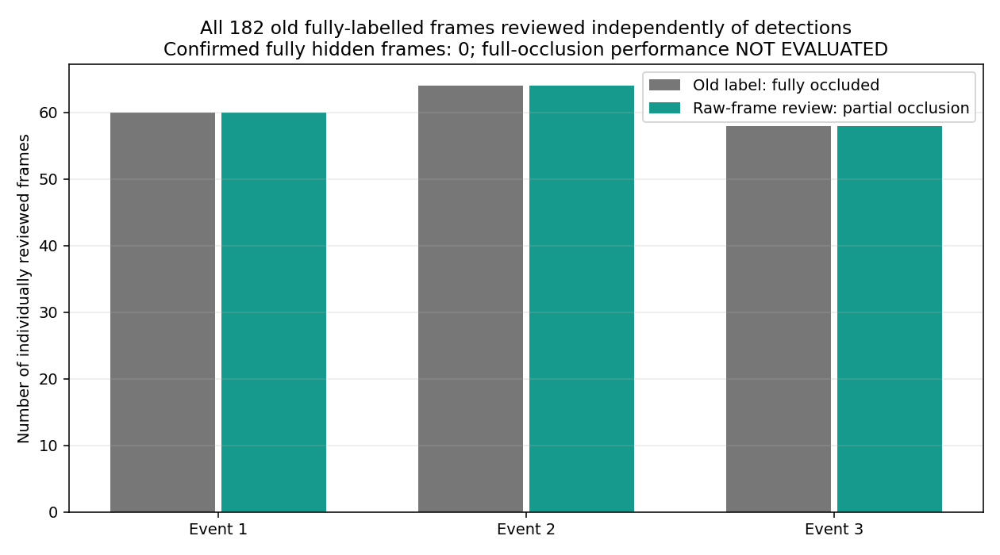
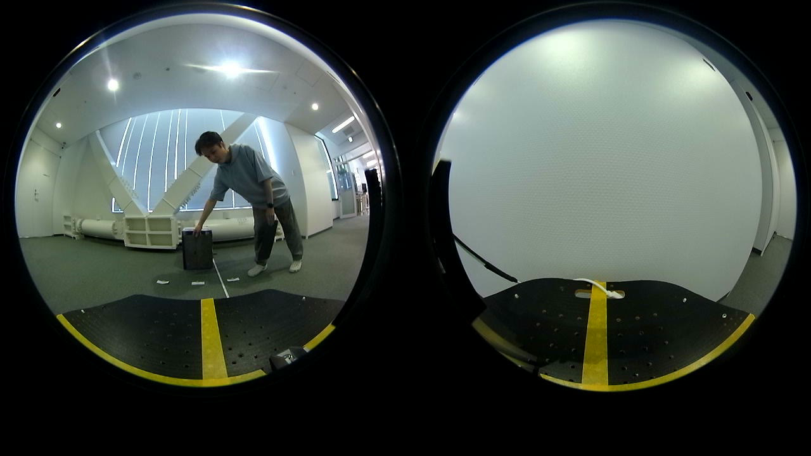

# 2026-10-06 遮蔽ラベルの目視再点検

## 全182フレームのレビュー完了（後続作業）

**旧「完全遮蔽」3区間を、検出の有無と独立に全フレーム確認した。182/182で箱の一部が可視であり、この区間だけでは真の完全遮蔽性能を評価できない。**

判定は1280×720の元画像全画角を目視した結果。検出成功／失敗から自動的にラベルを推定したものではない。箱の本体・上端等が一部でも見える状態を`partial_occlusion`、全体が見えない状態を`fully_occluded`、判断できないものを`uncertain`とした。3区間の外側や動画全体を再ラベル付けしたという意味ではない。

| 旧event | 保存frame（1始まり、両端含む） | 確認数 | レビュー結果 | 元画像の根拠 |
|---|---|---:|---|---|
| 1 | 142～201 | 60 | 全て部分遮蔽 | 板の下に青箱の下部が見える |
| 2 | 418～481 | 64 | 全て部分遮蔽 | 板の下に青箱の下部が見える |
| 3 | 766～823 | 58 | 全て部分遮蔽 | 板の上／左端に箱の上端・側面が見える |

### 設定を変えずに既存結果を再集計

元の位相ラベル、固定候補の動画再計算CSV、初回13点レビューは上書きしていない。別のレビュー表を結合した546行（182 frame×3方式）を保存した。

| 方式 | 部分遮蔽の生検出 | 測定採用 | trackあり（予測を含む） | 真の完全遮蔽の評価 |
|---|---:|---:|---:|---|
| baseline | 8/182 | 0/182 | 0/182 | **NOT_EVALUATED** |
| S130 nearest | 13/182 | 0/182 | 1/182（予測1） | **NOT_EVALUATED** |
| S130 bottom | 13/182 | 0/182 | 1/182（予測1） | **NOT_EVALUATED** |

完全遮蔽の正解frameは0なので、完全遮蔽中の検出率・測定採用率は`null`（CSVでは空欄）。「完全遮蔽の誤検出率0%、合格」とは扱わない。これまでの追跡喪失・復帰時間は**旧ラベル区間に対する数値**として残し、完全に箱が隠れた瞬間からの応答時間へ読み替えない。

13点の検出が実際の箱下部に対応することは初回レビューで確認した。全182 frameをレビューした今回も、候補で増えた5点を完全遮蔽の背景誤検出と扱う根拠はない。ただし部分遮蔽での低い検出率／測定採用0を成功とも扱わない。安全性・絶対距離精度・実機採用の判断は引き続き保留する。

### 追加保存物

- `full_manual_review.csv`: 全182 frameの目視分類と可視部分の根拠。検出0のframeも含む。
- `full_reviewed_frames.csv`: 旧／レビューラベル、3方式の検出・ゲート・追跡、記録時刻、元BGR全画素hashを結合。
- `full_review_phase_metrics.csv`、`full_review_event_metrics.csv`: 位相別・3区間別の集計。
- `full_review_validation.json`: 完全遮蔽が未評価であること、入力／出力hash、範囲・未変更の記録。
- `full_review_label_coverage.png`: 旧ラベルと全フレーム目視結果の比較。根拠は上記event CSV。
- `full_review_raw_assets_manifest.csv`: 第3区間frame 800の元動画・無加工PNG・全画素hash。
- `create_full_review_artifacts.py`と`src/evaluate_reviewed_occlusion.py`: 全区間被覆、重複・欠落、元結果との一致を検査して再集計する。対象なしを合格／率0としない。





追加画像は元の全画角・1280×720を維持したPNGで、切り抜き・注釈・明るさ／色補正なし。第2区間の[既存frame 431](../report_assets/box_validation_occluded_raw_frame_0431.png)も再利用できる。

```bash
python3 Experimental_results/2026-10-06/occlusion_label_review/create_full_review_artifacts.py \
  --recording-root /path/to/safely_extracted/202608261410
```

再集計は手作業分類を入力として使うため、目視判断自体を自動再生成するものではない。元動画SHA-256、旧集計・候補コードhash、全182 frame×3方式の集合と結果一致を要求する。旧レビューの`validation.json`もそのまま保存し、今回の結果は`full_review_validation.json`に分けた。

### 最終検証

- リポジトリ全体の単体テスト316件が成功（うち今回追加のレビュー評価テスト10件）。
- 入出力14ファイルのSHA-256が記録値と一致。
- 目視に使った全182枚の無加工PNGと、再集計時に元動画から再取得した全画素hashが一致。frame取り違え・画像加工による不一致なし。
- `git diff --check`で空白エラーなし。実機の設定・校正・FFB出力は変更していない。

### 次の確認

既存のUNKNOWN試験等から、対象の箱が完全に隠れる映像があるか確認する。その映像について検出結果を見る前に可視／部分遮蔽／完全遮蔽／判定不能区間を決め、固定候補で検出・採用・追跡喪失・復帰を比較する。既存素材で確保できない条件だけを追加録画の対象にする。今回の再分類に合わせて候補閾値を調整していない。

## 初回の13検出点レビュー（保存記録）

以下は全区間レビューに進む前の選択13点の確認内容。未確認169点の記載は**初回時点**の状態であり、現在の被覆範囲は上記の全182点である。

## 結論

**S130候補が旧「完全遮蔽」区間で検出した13点は、すべて遮蔽板の下に青箱の一部が見えていた。これらを背景の誤検出13点とは扱わない。**

- 対象: `x0.0mz1.2m_shahei_20260826_140829_186`のframe 142～151、153、431、435（保存CSVの1始まり）。
- 1280×720の元動画frameを無加工で確認し、候補bboxの位置と目視の箱下部を照合した。bboxは厳密なpixelマスクの正解ではなく、粗い位置対応の確認。
- 2つのS130候補の領域bbox・測定採用判定は13点で一致したため、領域の目視確認は共通。
- 13点とも`normalized_area_gate`で測定不採用。今回は安全ゲートを緩めていない。
- baselineが検出した8点もこの13点の集合に含まれる。候補で増えた5点についても、背景を拾ったとする根拠は得られなかった。

これは**検出があったframeを選んだ追加確認**である。全182 frameのpixelごとの遮蔽正解を新たに作ったものではなく、残り169 frameはこのレビューで未確認。候補にとって都合のよいラベルへ置き換えてfalse-positive率を再計算していない。全体の完全遮蔽性能・不要FFBの安全性を保証するものではない。

## 保存物

- `manual_review.csv`: 13 frameそれぞれの手作業確認結果。元画像では箱の下側の青面が可視。
- `reviewed_detections.csv`: 旧位相、レビュー位相、実記録時刻、候補bbox、採用結果、動画hash、元BGR全画素hash。
- `create_review_artifacts.py`: 元動画hash・frame範囲・選択集合・2候補の領域一致を検査し、確認表を再生成する。
- `validation.json`: 13点の確認範囲と未確認169点、既存ラベルを変更していない記録。

レビュー時に一時保存したPNGは全画角・無加工。代表画像は既存の[frame 431](../report_assets/box_validation_occluded_raw_frame_0431.png)を再利用し、日付別画像フォルダへ13枚の類似画像を重複追加しない。

## 再現

```bash
python3 Experimental_results/2026-10-06/occlusion_label_review/create_review_artifacts.py \
  --recording-root /path/to/safely_extracted/202608261410
```

目視レビュー自体は自動再生成されない。`manual_review.csv`を元動画の該当frameで再確認できるよう、動画・frame・画素hashを記録した。元の08/26位相ラベルと[固定候補検証](../box_contact_validation/README.md)の位相別集計はそのまま残す。

次に完全遮蔽を定量評価する場合は、検出の有無でframeを選ばず、対象区間全体を再点検する。箱の一部が見える状態はpartial、完全に見えない状態はfullyとし、レビュー後に設定を変更する場合は別の独立評価を用意する。
