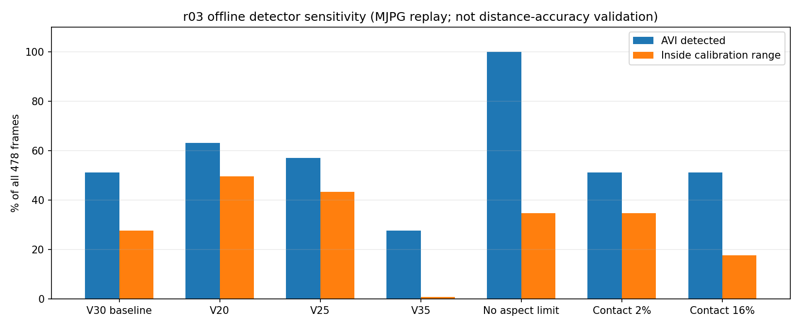
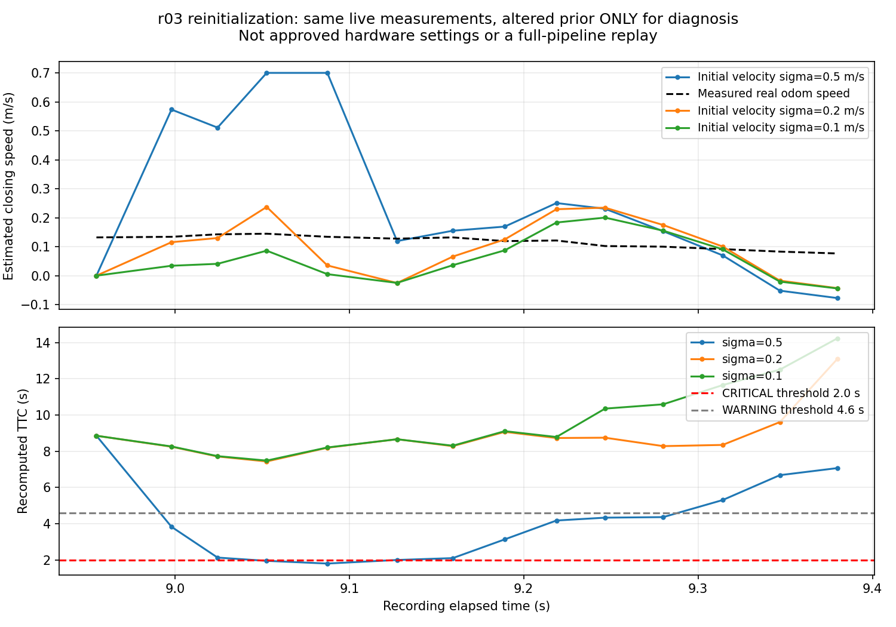

# 2026-10-06 青箱距離・TTC不安定性の原因切り分け

## 結論

**r03は、輪郭・接地点の不安定な測定と、再初期化直後の速度推定が重なってCRITICALになった可能性が高い。FFB通信の不調ではない。**

次の事実を分離して確認した。

1. 走行前・停止後にもr03の検出欠落と距離の飛びがある。実走行による距離変化だけでは説明できない。
2. 暗い青面に対するHSVのV閾値と横長輪郭除外の組み合わせに、r03が強く依存する。r01・r02は同じ変更に対して検出率100%を維持する。
3. ライブ測定をそのまま使った14 frameの追跡再生で、再初期化後の約0.70 m/sの推定接近速度と約1.80秒のTTCを再現した。実速度は約0.13～0.15 m/sだった。
4. 同じライブ追跡を使う速度源の比較では、現行conservativeでのみ問題があるのではなく、visual単独でも同じCRITICALになる。視覚測定・速度推定側の問題を裏付ける。

この結果を理由にV閾値を下げる、横長除外を撤去する、ODOMのみへ切り替える、初期速度共分散を小さくする、といった本番変更は行っていない。安全ゲート・adapter・本番設定・ROS送信処理は変更していない。

## 入力と評価範囲

- r01: `rokuga_phase5_v12_live_kobuki_hardware_r01_20261006_143236_125.tar.xz`
- r02: `rokuga_phase5_v12_live_kobuki_hardware_r02_20261006_150430_183.tar.xz`
- r03: `rokuga_phase5_v12_live_kobuki_hardware_r03_20261006_153755_541.tar.xz`
- 箱なし参考対照: `/home/robo25/Downloads/recoding/08251330.tar.xz`内の`hakonasi_20260825_131458_522`、853 frame。
- 箱なしアーカイブSHA-256: `4db8624cc4538fbf2b94e554af1e3f0133245530de6c613ede0af0ca3dd04760`。
- r01～r03のSHA-256・bag評価は各試行の`../phase5_v12_live_kobuki_hardware_r0*_diagnosis.md`に記録済み。
- r03は15:37:55.541～15:38:11.454643 JSTの録画だけを使用し、前半のテスト動作は含めない。
- 解析スクリプト: `../phase5_distance_instability_ablation.py`。

箱なし対照は別日・別背景であり、r03と同じ床での誤検出評価ではない。動画はMJPG再圧縮済みなので、AVI再検出をライブ結果と同一視しない。初期・停止位置の実測値がないため、距離の絶対精度を採点していない。

## 1. 停止状態でも測定が不安定か

ライブCSVを走行前、走行中、停止後0.5秒以降に分けた。走行区間は`odom_linear_mps > 0.03`の最初から最後までとし、停止直後0.5秒の過渡区間は停止後集計から除外した。

| 試行・区間 | frame | 検出率 | raw z標準偏差 | 隣接frameの距離変化とODOM前進量の不整合最大 |
|---|---:|---:|---:|---:|
| r01・走行前 | 315 | 100% | 0.00110 m | 0.00350 m |
| r02・走行前 | 173 | 100% | 0.00154 m | 0.00620 m |
| r03・走行前 | 167 | 74.25% | 0.01836 m | 0.05640 m |
| r01・停止後 | 242 | 100% | 0.00089 m | 0.00300 m |
| r02・停止後 | 169 | 100% | 0.00712 m | 0.02840 m |
| r03・停止後 | 179 | 31.84% | 0.23014 m | 0.50060 m |

標準偏差は「検出されたframeのraw z」だけで計算している。未検出frameを0 mとして含めない。r03の停止後raw zは1.1438～1.7341 mに広がり、箱が見えるのに測定採用は16/179 frame、8.94%だった。

不整合は`abs(z[t] - z[t-1] + ODOM前進量)`で、隣接した検出frameだけを評価した。箱が固定され、直進するという試験条件での診断値であり、実測距離誤差ではない。旋回・横位置の影響を厳密に補正したモデルでもない。ただし停止状態の約50 cmの飛びは、走行速度やFPS低下だけを原因とする説明に合わない。

根拠: `live_phases.csv`。

## 2. HSV・横長輪郭・接地点選択の感度

同じAVIを、検出器設定だけ変えて全frameで再検出した。カメラ幾何は録画metadataを維持した。ここでの「校正内」は位置の範囲チェックだけであり、有効測定採用・追跡・距離精度PASSではない。

| オフライン設定 | r03検出率 | r03校正内frame率 | r03隣接不整合の最大 | 過去の箱なし検出率 |
|---|---:|---:|---:|---:|
| V≥30、縦横比≤1.5、接地点8%（現行） | 51.26% | 27.62% | 0.486 m | 0% |
| V≥20、他は現行 | 63.18% | 49.58% | 0.494 m | 0% |
| V≥25、他は現行 | 57.11% | 43.31% | 0.506 m | 0% |
| V≥35、他は現行 | 27.62% | 0.84% | 0.384 m | 5.16% |
| V≥30、縦横比制限を実質撤去 | 100% | 34.73% | 0.507 m | 100% |
| V≥30、接地点2% | 51.26% | 34.73% | 0.507 m | 0% |
| V≥30、接地点16% | 51.26% | 17.57% | 0.415 m | 0% |

V下限を20へ下げると、暗い青面の欠損が減る方向の改善はあるが、検出率は63%にとどまり、距離の飛びも残る。検出率だけを見て採用しない。

縦横比制限を外すとr03は100%検出になる一方、箱なし対照も853/853 frameで検出する。この対照の推定位置は校正範囲外であり、今回の集計からFFB誤出力が853件あったとは言えない。しかし、検出器単体の誤検出抑制を失うため、除外撤去は解決策として採用しない。

接地点に用いる輪郭点の割合を変えても、欠落率は変わらない。原理上、HSV・形状で選ばれた輪郭の後処理だからである。接地点2%は距離側の結果を一部変えるが、輪郭不安定性を解決しない。

r01・r02はいずれの設定でも検出率100%だった。ただしr02はV≥25で隣接不整合3 cm超の件数が11から77へ増えるなど、検出率が同じでも距離推定は同じではない。

現行設定でもr03のAVI検出率51.26%とライブ検出率62.97%は異なり、検出／未検出が178/478 frameで一致しなかった。暗い青面が閾値付近にあり、再圧縮等の画素差に敏感な状態と考えられるが、差の全量をMJPG圧縮だけに帰属する実証はしていない。ライブ時点の正確な輪郭棄却理由をAVIから断定しない。

根拠: `detector_sensitivity.csv`、`detector_sensitivity_frames.csv`、`no_target_control/`。



## 3. 追跡再初期化後の増幅

frame 267でNIS棄却が継続して追跡が失効し、269でz=1.1708 mとして再初期化した。次の270でraw z=1.0510 mへ約43 msで約12 cm変わった。実速度から想定する前進量は約6 mmだった。

再初期化時の初期速度分散は`src/obstacle_tracking.py:53`の0.25、標準偏差換算で0.5 m/sである。同じライブ測定・時刻・NIS上限を使い、269～282の14 frameだけで初期速度分散を変えて影響を調べた。コード内の本番値は変更していない。

| 診断用初期速度標準偏差 | 推定接近速度の最大絶対値 | 最小TTC | 測定採用 |
|---|---:|---:|---:|
| 0.5 m/s（現行） | 0.7007 m/s | 1.800秒 | 13/14 |
| 0.2 m/s（比較のみ） | 0.2375 m/s | 7.437秒 | 14/14 |
| 0.1 m/s（比較のみ） | 0.2006 m/s | 7.484秒 | 14/14 |

現行値の局所再生はライブ速度と最大約0.0002 m/sの差で一致した。再初期化直後の測定差を速度へ強く反映することが、TTCの急減に寄与している。NISもframe 270で約6.41、272で約0.76と上限9.21以下なので、現行のNIS検査では問題の測定を棄却していない。

小さい初期分散でこの区間のピークが減ることは確認できたが、それが正しい速度推定・安全な設定であるとは限らない。実際に高速接近する物体への追従を遅らせる可能性があり、14 frameだけの比較では本番採用できない。

根拠: `reinitialization_prior_ablation.csv`。この局所再生は校正内のライブ測定を追跡器へ入力する切り分けであり、輪郭検出・再捕捉確認等を含む全パイプライン再試験ではない。



## 4. TTC速度源を変えるだけで解決するか

ライブ追跡位置・速度・時刻と衝突経路フラグを保持し、既存の`CausalTtcEstimator`と衝突状態フィルタで再生した。現行conservativeの衝突状態はr01・r02・r03すべてでライブCSVと全frame一致した。丸められた入力を使うため、TTCの小数値にはわずかな差がある。

| 方式 | r01通知状態frame | r02通知状態frame | r03通知状態frame | r03 CRITICAL | r03最小TTC |
|---|---:|---:|---:|---:|---:|
| conservative（現行） | 22 | 27 | 11 | 1 | 1.799秒 |
| visualのみ | 22 | 24 | 11 | 1 | 1.799秒 |
| ODOMのみ・静止物体仮定 | 0 | 16 | 0 | 0 | 7.293秒 |
| 新しい追跡の最初0.3秒のみODOM、その後現行 | 22 | 27 | 0 | 0 | 4.360秒 |

「通知状態frame」はWARNING・WARNING_HOLD・CRITICALの合計であり、実際の振動回数ではない。FFB cadenceやhardwareを再実行した結果でもない。最後の方式は原因切り分け用で、本番の機能追加ではない。

ODOMのみではr03のCRITICALは消えるが、r01の既存WARNINGも消える。静止箱という前提が必要であり、動く物体の相対速度を扱う最終目標へそのまま置き換えられない。r01のWARNING消失が実際の危険見逃しか、元の警告が早めだったかは、距離・速度の独立した正解値なしには判定しない。

新しい追跡の最初0.3秒だけ視覚速度を使わない比較では、r01・r02の通知状態を維持し、r03のCRITICALが消えた。再初期化直後の視覚速度が主要因であることを補強する。ただし、再捕捉直後に本当に急接近する物体への応答を保証できず、UNKNOWNもr03で22 frameのまま残る。測定系列自体が直ったわけではない。

根拠: `ttc_velocity_ablation.csv`、`ttc_velocity_ablation_frames.csv`、`provenance.json`。

## 5. 次の開発で必要な条件

追加録画を先に繰り返すのではなく、次は録画再生専用の候補評価で次を検証する。

1. 輪郭の欠損・接地点の急変を品質情報として記録し、距離測定の不安定さと実際の接近を区別できるか確認する。
2. 追跡の再初期化直後は、NISが通っただけで速度が十分信頼できると扱わない候補を評価する。単に速度をODOMへ固定する／値を上限で切ることを一般解としない。
3. 信頼できない測定を安全なCLEARへ見せかけず、UNKNOWN通知や有限保持の既存仕様との整合を確認する。
4. r01・r02のWARNING再現、r03の過大接近速度、過去の静止・後退・遮蔽・箱なし録画を同時に比較する。再捕捉直後の本当の高速接近に対する遅れも別途検証する。

現時点で新しい設定を実機試験用として提示しない。候補の実装・回帰結果がそろってから、実機の安全基準とともに採否を判断する。r03の実測初期・停止距離や今回の床での箱なし対照は、後で絶対精度・誤検出を確定する際に必要になるが、この原因切り分けのために今すぐ追加録画を要求するものではない。

その後、視覚速度の根拠を確認する録画再生専用候補を実装し、3試行・過去28 session・人工的な高速接近で比較した。[候補評価結果](../velocity_confidence_candidate/README.md)を参照。本番設定・実機出力には適用していない。

## 再現方法と検証

アーカイブを安全に展開したsessionのパスを指定する。

```bash
python3 Experimental_results/2026-10-06/phase5_distance_instability_ablation.py \
  --input /path/to/phase5_v12_live_kobuki_hardware_r01_20261006_143236_125 \
  --input /path/to/phase5_v12_live_kobuki_hardware_r02_20261006_150430_183 \
  --input /path/to/phase5_v12_live_kobuki_hardware_r03_20261006_153755_541 \
  --output Experimental_results/2026-10-06/phase5_distance_instability_diagnosis

python3 Experimental_results/2026-10-06/phase5_distance_instability_ablation.py \
  --no-target /path/to/hakonasi_20260825_131458_522 \
  --output Experimental_results/2026-10-06/phase5_distance_instability_diagnosis/no_target_control

python3 Experimental_results/2026-10-06/phase5_distance_instability_diagnosis/plot_ablation.py
```

- ライブconservative再生: 3試行とも衝突状態差0 frame。
- カメラCSV／動画frame数: 650、479、478、箱なし853で一致。
- `test_obstacle_tracking.py`: 12 tests PASS。
- `test_evaluate_collision_hysteresis_replay.py`: 1 test PASS。
- 新規解析スクリプトの構文、集計範囲・件数・局所再生の照合を確認した。
- グラフは同フォルダのCSVから生成した。カメラ画像の加工は行っていない。
- hardware出力・実機の再試験は実施していない。
