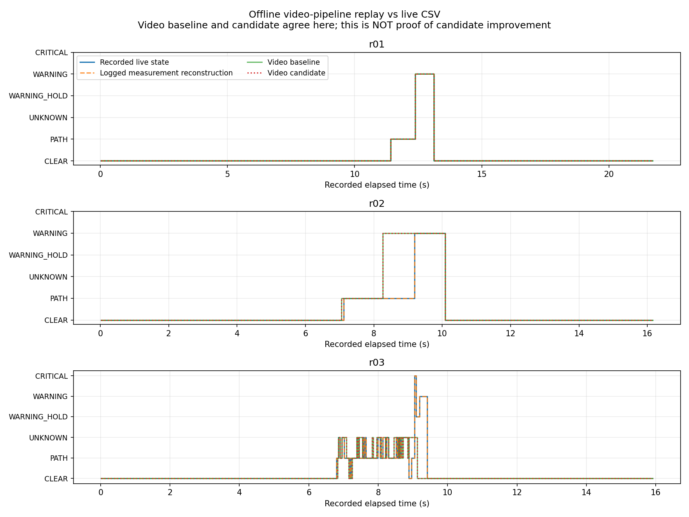
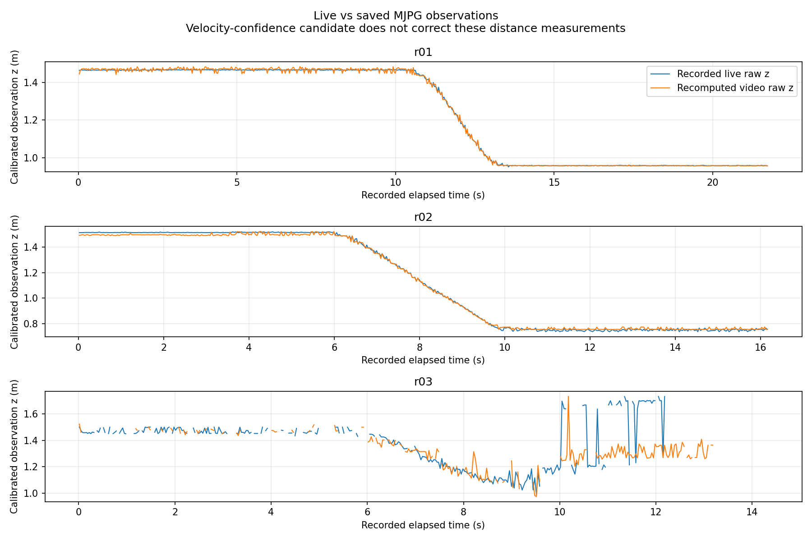

# 2026-10-06 保存動画からの検出・追跡・TTC再計算

## 結論

**青箱の動画処理経路を再計算する評価ツールを実装し、7 session・5,030 frameで比較した。速度根拠候補の実機採用を判断できる段階にはまだない。**

- 記録済み測定値からゲート・追跡・TTC・経路・衝突状態を再構築した対照は、7 sessionすべてでライブの衝突状態と一致した。
- 動画からの再計算では、r01の衝突状態は一致した。r02はWARNING開始が約0.933秒早まり、r03は候補なしでもCRITICALが発生しなかった。
- 全7 sessionの動画再計算では、候補追加による衝突状態・仮想activeの差は0 frameだった。元の距離・追跡系列がライブと異なるため、r03の問題解消を候補の成果として扱わない。
- 静止・後退・箱なしの代表対照では仮想通知なし。遮蔽を含む09/29の代表対照では仮想active区間7を維持した。
- 本番カメラ処理、設定、ROS送信、relay、adapter、安全ゲートは変更していない。実機を駆動していない。

前回の[ライブCSV後段での候補比較](../velocity_confidence_candidate/README.md)ではr03のCRITICALをUNKNOWNに変更できた。今回の結果はそれを否定するものではなく、「保存済みMJPG動画はライブ時の測定系列を完全には再現しない」ことを明確にしたもの。

## 実装と再計算範囲

追加: `src/evaluate_raw_velocity_confidence_replay.py`、`tests/test_evaluate_raw_velocity_confidence_replay.py`。

処理の流れは次のとおり。

```text
raw.avi各frame + 録画metadata
  → 青輪郭・接地点検出
  → 横位置／距離校正、校正範囲チェック
  → 面積正規化、再捕捉確認、NIS検査
  → 共有Kalman追跡、共有TTC推定
  → 記録ODOM/CMDから経路再計算、衝突経路判定
  → 候補なし／速度根拠候補ありの状態・仮想FFB
```

既存の`ground_contact.py`、`obstacle_tracking.py`、`collision_risk.py`、cadence/policy部品を使用する。カメラアプリを起動して画面や実機を操作するものではない。白線、GUI描画、YOLO、通信、adapter、物理出力は再生対象外。

従来の`evaluate_observation_gates.py`／`compare_observation_gates.py`はそれぞれ観測抽出・ゲート比較用であり、今回必要な校正範囲チェック等を含むライブ相当の青箱処理全体とは範囲が異なる。今回はそれらの挙動や本番処理を変更せず、専用評価ツールを追加した。

CSVの各frameに記録された時刻とODOM/CMDを、そのframeの外部入力として使用する。AVIの固定FPSから時刻を生成し直さない。TTC・経路・追跡速度・測定採否は再計算し、記録済み値を結果としてコピーしない。`collision_risk_level`だけは比較用のライブ正解列として保持する。

候補判定部に`prediction_linear_mps`列がある場合は、衝突状態の前進判定にその値を用いる対応を追加した。これは低速ODOM時のCMDフォールバックをカメラ処理と合わせるためであり、TTCは別途記録ODOMを使って計算する。列がない既存CSVの評価動作は維持する。対応箇所: `src/evaluate_velocity_confidence_replay.py`。

## フレーム対応と対照

入力は展開済みsessionまたはそれを含むディレクトリ。動画とCSVの対応を誤って採点しないため、以下を要求する。

- CSVのframe番号が1から連続している。
- 記録時刻が有限かつ厳密に増加し、使用するODOM/CMDが有限値である。
- 動画とCSVのframe数が等しい。短い／長い動画を黙って切りそろえない。
- metadataに撮影解像度がある場合、動画の解像度が一致する。
- 青箱ground_contact、追跡、衝突判定が有効である。対象外の無効化・別方式は明示的に拒否する。
- 指定入力に動画sessionがない場合はエラーにする。CSVだけの入力を黙って読み飛ばさない。

`logged_measurement_rebuild`は、ライブCSVの測定座標・面積・校正範囲判定だけを入力し、以後を同じ部品で再計算した対照である。これにより、動画の画素差による変化と、再計算処理の再現誤差を切り分ける。

ただし追跡器は録画冒頭で新規作成する。録画開始以前の状態スナップショットはない。09/29遮蔽、09/08静止・後退の3 sessionではframe 1だけ、ライブが測定採用済み、再構築が再捕捉確認待ちとなった。衝突状態への差は0だったが、全追跡状態の完全再現とは扱わない。CSV座標も0.1 mm単位へ丸められており、内部数値までの同一性は保証しない。

## 10/06 r01～r03

| 試行・入力 | 検出frame | 採用frame | WARNING | HOLD | CRITICAL | UNKNOWN | 仮想active区間 |
|---|---:|---:|---:|---:|---:|---:|---:|
| r01 ライブ測定再構築 | 650 | 308 | 22 | 0 | 0 | 0 | 3 |
| r01 動画・候補なし／あり共通 | 650 | 308 | 22 | 0 | 0 | 0 | 3 |
| r02 ライブ測定再構築 | 479 | 270 | 27 | 0 | 0 | 0 | 3 |
| r02 動画・候補なし／あり共通 | 479 | 272 | 55 | 0 | 0 | 0 | 3 |
| r03 ライブ測定再構築 | 301 | 85 | 7 | 3 | 1 | 22 | 3 |
| r03 動画・候補なし／あり共通 | 245 | 104 | 0 | 0 | 0 | 34 | 1 |

根拠: `summary.csv`、`frame_results.csv`、各sessionの`recomputed_inputs.csv`／`logged_measurement_rebuild_inputs.csv`。

- r01はライブ／動画の衝突状態差0。WARNING開始は両方12.389616秒。
- r02は検出／未検出の差0だが、採用frameが2点異なり、衝突状態は30 frame異なる。WARNING開始はライブ再構築9.190538秒、動画8.257886秒、差−0.932652秒。単に検出率100%を見てもTTC再現性は判断できない。
- r03は検出／未検出が178/478 frame異なり、測定採否105 frame、衝突状態40 frameが異なる。動画では再初期化・速度系列も変わるため、ライブの過大接近速度を同じ経路で再現できなかった。

r03の動画側でCRITICALがなくなったのは、候補が抑制した結果ではない。候補なしでも0で、今回の動画比較で候補が高リスクを保留したframeは全sessionで0だった。

保存動画はMJPGへ再圧縮されている。暗い青面の閾値付近での画素差や輪郭・接地点の差に敏感と考えられるが、差の全量を圧縮だけに帰属する独立実証はしていない。今回の時刻・動作入力・パラメータは方式間で固定している。





図の距離は測定結果であり、実測正解値ではない。r02のユーザー申告初期距離1.3 mと、反射を含む推定距離の差を補正・採点していない。候補は距離値を修正しない。

## 過去の代表対照

| 対照 | frame | 動画WARNING | 動画UNKNOWN | 仮想active区間 | 候補追加による状態差 |
|---|---:|---:|---:|---:|---:|
| 09/08 静止r01 | 622 | 0 | 0 | 0 | 0 |
| 09/08 後退0.1 m/s r01 | 647 | 0 | 0 | 0 | 0 |
| 08/25 箱なし | 853 | 0 | 0 | 0 | 0 |
| 09/29 hardware UNKNOWN・遮蔽r01 | 1,301 | 266 | 64 | 7 | 0 |

根拠: `motion_controls/summary.csv`、`controls/summary.csv`、`comparison_summary.csv`。遮蔽対照はライブ測定再構築でWARNING 269、UNKNOWN 61、動画再計算で266、64。衝突状態のライブ差は6 frameだが、仮想active区間7は維持した。

各録画のmetadataを使用しており、すべてを最新v12設定へ一括変更した試験ではない。特に08/25箱なしは横長輪郭除外導入前の設定で、853/853 frameに青輪郭検出があるが、すべて校正範囲外となり測定採用・仮想通知は0。これは検出器の誤検出が直ったことを意味しない。最新設定の同対照は[先行の検出感度診断](../phase5_distance_instability_diagnosis/README.md)に記載済み。

前回のCSV後段比較は過去28 sessionを対象にしたが、今回の動画再計算は代表対照4 sessionと10/06の3 sessionだけである。全過去録画の動画再計算を完了したとは扱わない。

## 保存物・検証

- `summary.csv`: 再構築・動画baseline・動画candidateの定量集計。
- `frame_results.csv`: 衝突状態、速度根拠、仮想通知の全frame結果。
- `live_video_comparison.csv`: ライブと動画の測定・採否・状態比較。
- `comparison_summary.csv`: 7 sessionの差分件数。`plot_raw_replay.py`で再生成。
- `controls/`、`motion_controls/`: 過去代表対照の同形式の結果。
- 各`provenance.json`: 元動画・CSV・metadata、実装8ファイルのSHA-256、適用範囲。
- `validation.json`／`validate_results.py`: 7 session・5,030 frame、再構築対照の状態差0、候補による追加差0、実装hash一致を確認するチェック。実機の合否判定ではない。
- 新規12テストPASS。経路計算はカメラの実メソッドを非GUIのstub上で呼び、選択速度・角速度・経路の一致を確認した。
- ROS Humbleと`oit_interfaces`環境を読み込んだ全体テスト: **248 tests PASS**。
- 構文チェック、変更差分の空白チェック、出力provenanceと現行実装のSHA-256一致を確認した。
- グラフ2点はCSVから生成。カメラ画像の加工はしていない。3D matplotlibの環境警告は出たが、本グラフは2Dで生成・確認済み。
- PyTorch／YOLOは未導入で、今回の青箱再計算には使用していない。YOLO統合の成功を意味しない。

## 再現コマンド

```bash
python3 src/evaluate_raw_velocity_confidence_replay.py \
  --input /path/to/extracted/session_r01 \
  --input /path/to/extracted/session_r02 \
  --input /path/to/extracted/session_r03 \
  --output-dir Experimental_results/2026-10-06/raw_velocity_confidence_candidate/recheck

python3 Experimental_results/2026-10-06/raw_velocity_confidence_candidate/plot_raw_replay.py
python3 Experimental_results/2026-10-06/raw_velocity_confidence_candidate/validate_results.py
```

入力sessionには`raw.avi`、`metadata.json`、`detections.csv`が必要。`.tar.xz`を直接指定するCLIではないので、既存の安全な展開手順で展開後に指定する。今回、静止・後退の動画が既存の診断用一時フォルダに無かったため、`/home/robo25/Downloads/recoding/202609081440.tar.xz`を既存の`safe_extract_archive`で`/tmp/phase5_raw_video_controls__bkq_0b5`へ展開して使用した。生動画はGit管理対象へ追加していない。

## 判断と次の作業

1. 速度根拠候補は引き続きオフライン専用とする。ライブCSVでの過大速度抑制と、動画再計算での挙動を分けて管理する。
2. 次の優先課題は距離測定の品質である。青輪郭の欠損、横長判定、接地点のばらつき、距離急変を観測品質として記録できるか、保存動画で診断する。速度の根拠確認だけで距離不安定性は解決しない。
3. 再初期化直後に本当に急接近する独立した実測録画がまだ無い。人工系列による応答確認を実機の安全性保証へ置き換えない。
4. 生画素に近い記録方法とライブ内部状態の保存は、今後再現性を改善する候補。ただし今回の作業で録画形式や本番実装は変更していない。

追加録画をせずに、処理経路の再計算と再現性の限界を数値で確認するところまで完了した。

続いて[輪郭・接地点の品質診断](../ground_contact_quality_diagnosis/README.md)を実施した。r03の輪郭の欠け方・接地点のばらつきを定量化した一方、単一品質閾値で距離の急変だけを除外できるとは判断していない。本番ゲートへの反映はしていない。
