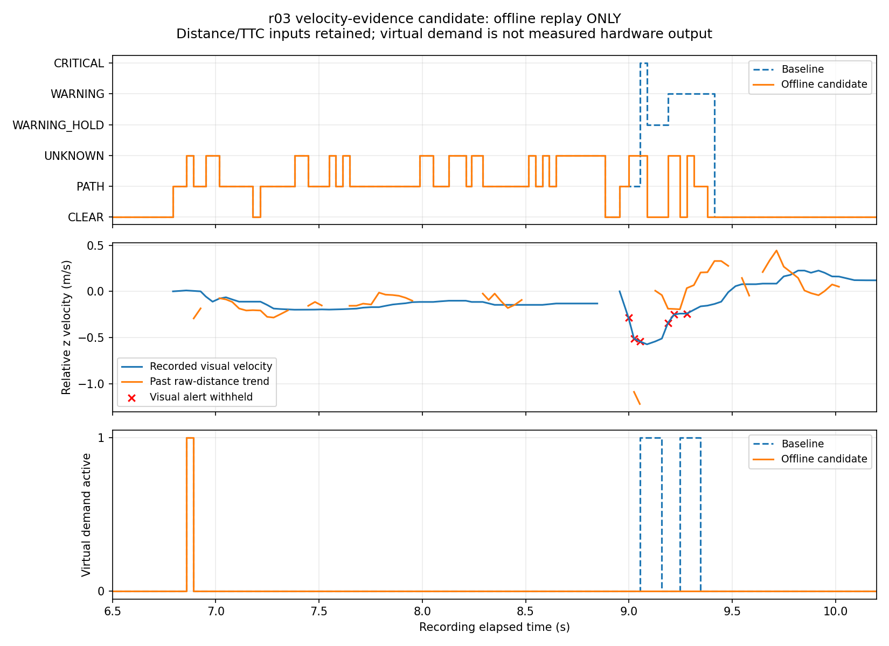
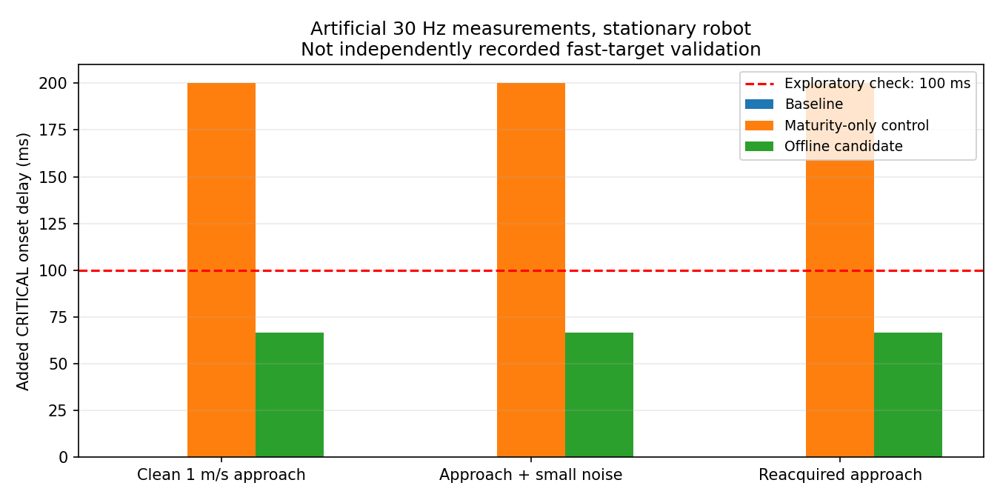

# 2026-10-06 視覚速度の根拠確認候補・オフライン比較

## 結論と適用範囲

r03の原因診断を受け、再初期化直後の不安定な距離系列から高い衝突リスクを確定しない**録画再生専用の候補**を実装した。実機には適用していない。

- 10/06 r01・r02のWARNINGと仮想3連通知を維持した。
- r03のCRITICAL 1 frame、WARNING 7 frame、WARNING_HOLD 3 frameは候補で0になった。不確かな状態をCLEARとせず、UNKNOWNへ遷移させた。
- 過去28セッション、18,039 frameは、今回の候補なし再生と比較して衝突状態・仮想出力activeの差0 frameだった。
- 人工的な1 m/sの接近では、停止中のロボットでもODOMで視覚速度を制限せず、約0.067秒でCRITICALになり、その後の一貫した接近では継続した。

これは開発用比較であり、距離精度の改善、実物の高速接近に対する安全性、実機FFBの改善を実証した結果ではない。`bird_eye.py`、追跡器、TTC推定器、本番JSON、relay、adapter、安全ゲートは変更していない。ROS初期化・送信・デバイスアクセスも行っていない。

## 実装したもの

- `src/offline_velocity_confidence.py`: 過去と現在のraw zから、測定系列と視覚速度の整合を確認する部品。
- `src/evaluate_velocity_confidence_replay.py`: 同じ録画CSVから候補なし／候補ありの状態と仮想FFBを比較し、根拠CSVを保存するCLI。
- `tests/test_offline_velocity_confidence.py`、`tests/test_evaluate_velocity_confidence_replay.py`: 欠落、再初期化、時間逆転、距離の急変、静止・後退、高速接近、有限保持等の自動テスト。

GUIや実機起動コマンドから候補が呼ばれる経路はない。既存ログの追跡・TTC・経路判定を固定して影響を調べるため、raw動画からの全処理再実行ではない。

## 判定方法

視覚速度が選ばれたWARNING／CRITICAL候補だけに追加の根拠を要求する。ODOM由来の通知と、通常のPATH／CLEARは変更しない。

1. 現在の測定が採用され、校正内で、予測だけでないことを要求する。
2. 通常は直近0.3秒内の5点以上、時間幅0.2秒以上の系列を使う。0.06秒以上離れた測定対の傾きの中央値で距離変化傾向を求める。
3. 残差の中央値と最新点の残差が各3 cm以下、視覚速度とのずれが`0.1 + 0.35 × |傾き| m/s`以下なら根拠ありとする。
4. CRITICALには短い独立確認経路も設ける。直近0.1秒の少なくとも3点、時間幅0.05秒以上で、前後の区間が接近を示し、区間速度同士と視覚速度が整合すれば、通常窓の成熟前でも通知を許可する。単純な0.2秒待機による急接近への遅れを比較するためである。
5. 根拠が不足する視覚由来の高リスク候補は「測定不確か」として既存の状態フィルタへ渡す。既存の有限保持とUNKNOWN単発・再armを使用する。

再初期化、追跡失効、時間逆転では履歴をリセットし、測定欠落時は短時間確認を切る。履歴は最大32点で、未来のframeは参照しない。上記の「根拠あり」は経験的な整合確認であり、校正済みの統計的信頼確率ではない。

傾きの中央値は[公式SciPyのTheil–Sen説明](https://docs.scipy.org/doc/scipy/reference/generated/scipy.stats.theilslopes.html)を参考にした。本候補では短い時間差の測定対を除外し、独自の残差・速度整合条件を組み合わせており、SciPyの信頼区間を実装したものではない。追加依存関係は導入していない。

## 10/06実走行CSVの比較

| 試行・方式 | WARNING | HOLD | CRITICAL | UNKNOWN | 仮想active frame | 仮想active区間 |
|---|---:|---:|---:|---:|---:|---:|
| r01・候補なし／あり共通 | 22 | 0 | 0 | 0 | 7 | 3 |
| r02・候補なし／あり共通 | 27 | 0 | 0 | 0 | 10 | 3 |
| r03・候補なし | 7 | 3 | 1 | 22 | 7 | 3 |
| r03・候補あり | 0 | 0 | 0 | 28 | 1 | 1 |

根拠: `live_trials/summary.csv`、`live_trials/frame_results.csv`。3試行とも候補なしの衝突状態は記録済み状態と全frame一致した。r03では6 frameの高リスク候補を保留し、保持・クリア処理を含め状態が13 frame変わった。

仮想active区間は連続active frameのまとまりであり、物理的に知覚された振動回数ではない。r03に残る1区間は元からあるUNKNOWN単発であり、確認不足になった各frameで単発を繰り返したわけではない。

仮想cadenceをCSV時刻から再計算したため、r01・r02のactive frame数は実録の送信frame数（8、11）と1 frameずつ異なる。hardwareログを再評価した数ではなく、候補同士の差を比較する数である。仮想要求振幅は既存policy値で、adapterの物理上限0.05が適用された実出力ではない。



## 過去録画の回帰比較

| 入力群 | session | frame | 候補なし→ありの状態差 | 仮想active差 |
|---|---:|---:|---:|---:|
| 09/08、09/03、09/29 dry_run・hardware WARNING、08/25箱なし | 27 | 16,738 | 0 | 0 |
| 09/29 hardware UNKNOWN・遮蔽 | 1 | 1,301 | 0 | 0 |

根拠: `historical_replay/`、`hardware_unknown_replay/`。静止・後退・接近、箱なし、遮蔽を含む。全raw動画パイプラインや全条件の正解値を検証した「安全回帰PASS」ではない。

旧09/08ログの3 sessionでは、候補なし再生でも記録当時の状態と4、17、11 frame異なる（合計32 frame）。該当は`approach_center_v0p10_r03_20260908_144024_286`、`approach_center_v0p20_r02_20260908_143837_964`、`approach_center_v0p20_r03_20260908_144130_128`。現行状態フィルタを旧記録に適用した比較であり、当時の処理の完全再現ではない。今回の候補による追加差は0だが、旧ログとの一致を達成したとは扱わない。

## 高速接近と人工的な距離揺れ

30 Hz、ロボット速度0、物体の相対接近1 m/sを想定し、距離・視覚速度・TTCを整合させた人工系列で確認した。0.1秒以内という比較基準は開発用の探索値であり、制動距離等に基づく安全要求ではない。

| 人工条件 | 通常窓成熟だけのCRITICAL追加遅れ | 短時間確認を含む候補 | 候補の通知状態 |
|---|---:|---:|---|
| 一定速度の接近 | 0.200秒 | 0.067秒 | UNKNOWN 2 frameの後CRITICAL継続 |
| 小さな測定揺れを加えた接近（最大4 mm） | 0.200秒 | 0.067秒 | 同上 |
| 一度欠落して再捕捉する接近 | 0.200秒 | 0.067秒 | 同上 |
| r03に似た距離の往復揺れ | CRITICALなし | CRITICALなし | UNKNOWNを維持 |

最初の仮想UNKNOWN通知の追加遅れはいずれも0秒。根拠: `synthetic_summary.csv`、`synthetic_frames.csv`、`synthetic_checks.json`、再生成用`validate_candidate.py`。

一貫した距離下降を示す人工条件は通ったが、連続した反射由来の誤測定を本当の接近と誤認する可能性は残る。また実測の欠落・低FPS・ノイズが大きい場合はUNKNOWNが長く続く可能性がある。人工系列の視覚速度・経路フラグを与えているため、追跡器の応答速度やカメラ認識までの遅れを保証しない。

WARNINGには短時間CRITICAL確認を流用しない。新しい追跡が最初からWARNINGを要求する人工条件では、通常の確認3 frameに加え、履歴成熟により候補なしより0.2秒遅くWARNINGになる（開始から約0.267秒）。UNKNOWN通知は最初から出るが、これをWARNING遅延がなくなったとは扱わない。r01・r02は警告前に履歴が成熟しているため、この追加待ちが発生しなかった。



## 検証

- 新規25テストPASS（部品15、再生10）。
- ROS Humbleとローカル`oit_interfaces`環境を読み込んだ全体テスト: **236 tests PASS**。
- PyTorch／YOLOはこの環境に未導入。今回の青箱・CSV候補比較に使用していない。YOLO統合試験の成功を意味しない。
- カメラ画像は加工していない。2グラフは保存済みCSVから`plot_candidate.py`で再生成できる。
- `provenance.json`に設定、入力ディレクトリ、実装SHA-256を保存した。元アーカイブとライブ診断の対応は各r01～r03診断に記載済み。

## 再現コマンド

保存済みsessionディレクトリまたは`.tar.xz`を指定する。追加録画、ハンコン接続、ROSノード起動は不要。

```bash
python3 src/evaluate_velocity_confidence_replay.py \
  --input /path/to/recording_r01.tar.xz \
  --input /path/to/recording_r02.tar.xz \
  --input /path/to/recording_r03.tar.xz \
  --output-dir Experimental_results/2026-10-06/velocity_confidence_candidate/recheck

python3 Experimental_results/2026-10-06/velocity_confidence_candidate/validate_candidate.py
python3 Experimental_results/2026-10-06/velocity_confidence_candidate/plot_candidate.py
```

比較対照の成熟待ち方式は同CLIに`--disable-fast-critical-evidence`を追加して再生できる。

## 次に必要なこと

1. 本候補は録画ログの後段評価として保持し、独立した録画で閾値固定後の比較を行う。今回のr03を再度「独立評価」として使わない。
2. raw動画から検出・追跡・TTCを再実行する経路でも比較する。ライブとMJPG再圧縮動画の検出差を分離して報告する。
3. 距離の不安定さ自体は未解決のため、輪郭／接地点の品質情報を追加する設計を検討する。単に通知を減らして距離改善と扱わない。
4. 実機採用前に、実物の高速接近・再捕捉・連続した反射誤測定に対する独立検証と遅れの許容基準を定める。実機反映は別途承認を受ける。

今回の到達点は「現象の原因から、候補を作り、既存録画と人工系列で副作用を比較できるようになった」までである。

続いて[保存動画からの検出・追跡・TTC再計算](../raw_velocity_confidence_candidate/README.md)を実施した。動画ではr03のCRITICALが候補なしでも発生しなかったため、動画比較を候補の改善実証として扱っていない。7 sessionの比較CSV・グラフと再現性の制約を同資料に保存した。
