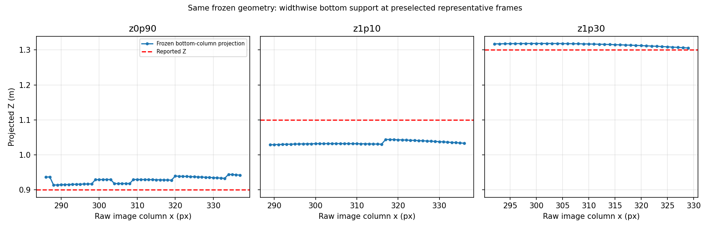
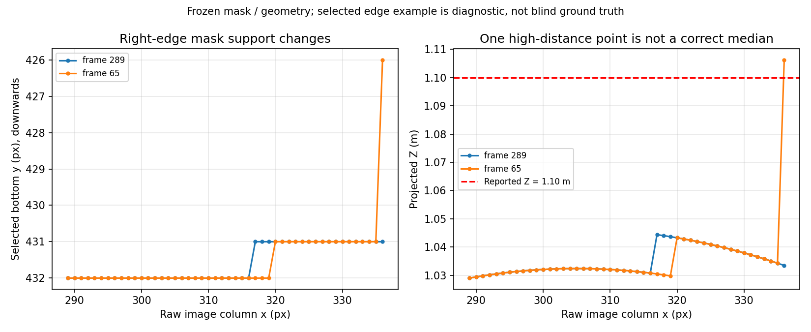

# 2026-10-07 箱下端の幅方向分布と距離依存の診断

## 結論

**下端中央の1点だけが悪かった、または左／右の代表点へ切り替えれば1.10 mが合う、という説明は今回の凍結マスクでは支持されなかった。** 1.10 m条件の下端の左・中央・右の中央値は、いずれも約1.031～1.039 m。幅方向に広げても短めの代表値が残る。

一方、全frameを調べると右端の1列だけが約1.106 mになる場面もあった。これを隠して「すべての点が1.10 m未満」とはしない。ただし、その点は全支持点の約0.70%で、色マスクの細部が欠けて選択下端が上へ移った例と整合する。その点だけを申告距離へ近いから採用することはしない。

これは**凍結した接地点候補内での切り分け**であり、投影モデルの誤りを一意に証明した結果ではない。独立した接地線ラベルや絶対カメラ姿勢がないため、真の底部の定義・固定投影モデル・設置誤差の完全分離はできない。本番コード・設定・校正・安全ゲートは変更せず、ROS送信／ハードウェア駆動も行っていない。

## 条件と方法

入力は親フォルダの4録画・凍結比較・[ユーザー確認記録](../reference_conditions.json)。3距離はすべてカメラ直下／Kobuki中心から測定、高さ・傾き変更なしとして扱う。申告距離を改名・補正していない。

1. 10/06から凍結されているS130 bottomと同じ色閾値・opening・成分選択・中央80%の列幅を使用。
2. 各列の最下段の色マスクpixelをそのまま選ぶ。申告距離を使ってpixelや列を選ばない。
3. 本番と同じレンズ光線→床面投影と有効光線・距離範囲判定を適用する。今回はZ offsetが0の録画に限定し、raw Zと申告Zの定義を混ぜない。
4. 中央80%を画像上の固定された幅で左・中央・右の3分割。欠落列を補間したり、距離が近い点へ選び直したりしない。
5. 全frameの座標・pixel中央値を凍結済みS130 bottomと照合。その後、元解析と同じ「2秒以降」を集計。

全4録画2,294 frame、箱あり1,973 frame、投影支持点89,837点。箱なし321 frameは支持点0。全箱ありframeで再計算中央値が凍結CSVと完全一致（最大差0）。幅を3分割したframe統計は7,892行、初期2秒除外後は1,793 frame／81,553支持点。各点・各frameは相関があり、独立した実験回数とは数えない。

## 下端の左・中央・右を選んだ場合

各frameの各領域のZ中央値を取り、そのframe間の中央値を算出した。全frameの全支持点を一つに混ぜた中央値ではない。

| 申告距離 | 左領域 | 中央領域 | 右領域 | 中央80%全体 |
|---|---:|---:|---:|---:|
| 0.90 m | 0.9169 m | 0.9296 m | 0.9366 m | 0.9298 m |
| 1.10 m | 1.0314 m | 1.0322 m | 1.0389 m | 1.0323 m |
| 1.30 m | 1.3183 m | 1.3168 m | 1.3101 m | 1.3169 m |

1.10 mのどの領域も約6.1～6.9 cm短い。別の領域の中央値へ変えるだけでは解消しない。全体中央値の申告距離に対する偏りは、0.90 mで＋2.98 cm、1.10 mで−6.77 cm、1.30 mで＋1.69 cm。一律offsetの不足を示す形ではないが、3配置だけで普遍的な距離補正曲線を決める根拠にもならない。

根拠：[集計CSV](support_summary.csv)、[全frameの領域統計](frame_zone_statistics.csv)。この数値はS130 bottomであり、現行liveの0.9179／1.0185／1.2949 mとは分けて扱う。



図は事前に選択済みのframe300／289／299の支持点。横軸はraw画像のx列、縦軸は投影Zで、画像へ線や注釈を加えたものではない。3条件の同じ凍結投影を比較しており、実物の下端の全幅を独立にラベル付けした結果ではない。

## 1.10 m付近になる右端の点をどう解釈するか

- 2秒以降553 frameのうち186 frameで、支持点の最小～最大範囲に1.10 mが入った。
- その186 frameでは、それぞれ**右端の1支持点のみ**が1.10 m以上だった。1.10 m以上の点は186／26,583点＝約0.70%。186 frameは約33.6%だが、多数の点が正しく1.10 mへ集まっていたという意味ではない。
- 左領域の全点の最大は約1.0463 m、中央領域は約1.0456 m。右端以外を含む代表値は、前表の約1.03～1.04 mのまま。

この例を調べるため、「2秒以降で初めて支持点のZが申告値以上になるframe」という診断基準からframe65（2.207211秒）を選択した。これは出力を見た後の事例選択であり、blind評価用frameではない。

frame65の右端x=336では、選択される下端がy=426となり、Z=1.1063 mになる。同frameの全48点のZ中央値は1.0322 m、95百分位は約1.0427 m。事前選択のframe289では同じx列の下端がy=431で、Zは約1.0334 mだった。右端の1列が5 px上へ変わったことが、大きいZの点として現れている。

raw HSVとマスクを確認すると、frame65・x=336では以下を記録した。

| y | HSV S | weakマスク・opening前 | opening／成分選択後 |
|---:|---:|---:|---:|
| 426 | 176 | 有効 | 有効 |
| 427 | 119 | 無効（S130未満） | 無効 |
| 428 | 176 | 有効 | 無効 |
| 431 | 176 | 有効 | 無効 |
| 432 | 29 | 無効 | 無効 |

この列で色閾値・opening／成分選択の後に下部の細部が支持点として残らないことを確認した。ただし色の数値だけから真の接地線を確定できず、全186 frameの個別原因も独立に目視確認していない。「大きいZの1点があったから、その点こそ正しい」とは判定しない。

根拠：[選択事例の全48列](edge_event_column_points.csv)、[raw HSV／マスクの数値](edge_event_pixel_evidence.csv)、[未編集のframe65](../../report_assets/distance_reference_z1p10_right_edge_raw_frame_0065.png)、[PNG抽出manifest](../../report_assets/distance_reference_z1p10_right_edge_export_manifest.csv)。PNGは全画角1280×720・元rawのデコードと画素一致。切抜き・色補正・描画なし。



グラフの入力は支持点CSV。frame65と289の比較であり、箱の実距離が変わったことを示す図ではない。

## 判断と次の作業

ここまでで、既存録画を使う今回の「中央1点の選択が原因か」という診断は完了。凍結候補内では幅方向に選択領域を変えても1.10 mの偏りは解消せず、稀に申告値に近くなる右端1点を採用する方法も正当化されなかった。

次の段階は、**床上の距離基準点と接地線を独立に確認できる情報で、固定投影モデルを評価すること**。まず過去の基準録画を再利用できるか確認する。ローカルの`Downloads/recoding/coding_20260807_6.tar.xz`内に、過去のfinal評価表と同名の`x=±0.22, z=0.95/1.20`の4 sessionとraw／metadata／CSVがあることを読み取りで確認した（[候補入力一覧](historical_input_inventory.json)）。安全展開・整合性・設定と測定定義の対応を確認してから凍結候補を再生比較できる。今回まだ再解析した結果ではなく、過去に閲覧したholdoutを新しいblind最終評価とは扱わない。

`holdout.tar.xz`という名前の別アーカイブには`x=±0.15, z=0.90/1.15`が入っており、上記final基準点とは別。名前だけで取り違えない。

後続作業で[過去4配置の再評価](../historical_distance_comparison/README.md)も完了した。全動画の件数一致、当時の評価24項目の再現、凍結候補の距離・横位置比較を確認済み。bottom候補は過去4配置でX誤差が悪化したため本番採用しない。上記の「まだ再解析していない」は候補発見時点の記録であり、現在の残作業ではない。

それでも不足する物理基準には、例えば距離が分かる床マーカー、実測したカメラ絶対高さ・姿勢、候補検出と独立した下端ラベルを使う。既存の3距離は診断用として保持し、補正を設計する場合は別の未使用距離・配置を評価用に残す。今すぐ同じ3本を丸ごと録り直すようには求めない。

今回の録画だけで固定投影モデル・色領域の下端定義・設置誤差を一意に分離したり、採用できる校正値を決めたりすることはできない。この不足を、今回3点に合わせた高次曲線や距離別offsetで埋めない。

## 保存物・再現・検証

- [analyze_bottom_support.py](analyze_bottom_support.py)：全rawの逐次デコード、支持点再計算、凍結結果照合、frame別／領域別統計、右端事例の数値検査、幅方向グラフ。
- [create_edge_assets.py](create_edge_assets.py)：保存済み支持点から比較グラフを作成し、frame65のraw PNG・manifestとの対応と画素一致を検証。
- [verification.json](verification.json)：全4録画のhash、関連実装hash、選択手順、適用範囲。
- [edge_assets_verification.json](edge_assets_verification.json)：比較グラフの入力hash、PNGの対応確認。
- [test_bottom_support.py](test_bottom_support.py)：欠落列を埋めないこと、空検出を距離0にしないこと、中央幅、zone対応、距離をpixel選択へ流用しないこと、初期区間の除外等、7 tests PASS。

```bash
MPLCONFIGDIR=/tmp/theta_matplotlib python3 \
  Experimental_results/2026-10-07/distance_reference_analysis/bottom_support_diagnosis/analyze_bottom_support.py \
  --session-root ROOT

MPLCONFIGDIR=/tmp/theta_matplotlib python3 -m unittest discover \
  -s Experimental_results/2026-10-07/distance_reference_analysis/bottom_support_diagnosis -p 'test*.py' -v
```

ROOTは[元解析](../README.md)と同じ安全展開済み4録画の親フォルダ。元動画をGitへ追加しない。frame65のPNGは既存`Experimental_results/2026-10-06/v12_occlusion_screening/export_review_frames.py`へ`--session-dir ROOT/z1p10/SESSION --output-dir Experimental_results/2026-10-07/report_assets --prefix distance_reference_z1p10_right_edge --frames 65`を指定して抽出する。その後`MPLCONFIGDIR=/tmp/theta_matplotlib python3 Experimental_results/2026-10-07/distance_reference_analysis/bottom_support_diagnosis/create_edge_assets.py`で右端比較グラフとPNG検証を再生成できる。

新規テスト7件、全frameの厳密再計算、構文、ローカル文書リンク、provenanceと出力件数の確認、差分空白はPASS。2グラフと追加raw PNGを目視確認した。既存の本番・前段解析の成功済み検証は再利用し、変更していない本番全回帰／ROS通信／実機FFBは再実行していない。MatplotlibのAxes3D警告は今回の2D出力には影響しない。
