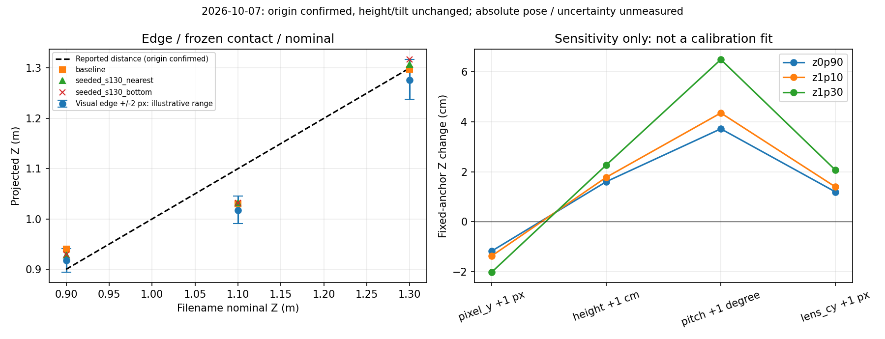

# 2026-10-07 静止距離の接地点／床面投影の切り分け

## 結論

**1.10 m条件の短めの出力は、奥行き補正の適用漏れ・範囲ゲートによる間引き・今回比較した接地点候補の違いだけでは説明できない。目視下端を現行の光線モデルへ直接入れても約1.018 mになる。**

後続回答により、**すべてカメラ直下／Kobuki中心からの距離で、高さ・傾きは変えていない**と確認できた（[回答記録](reference_conditions.json)）。この回答を今回3条件へ反映し、試行間で測定起点や取り付けを変えたという仮説は置かない。箱側終点の詳細、設置誤差、カメラの絶対高さ・角度の数値は未記録。「配置が間違っている」「レンズモデルが間違っている」のいずれも確定していない。距離ラベルは保持し、1.10 mへ出力を合わせる変更はしていない。

本診断はオフラインの追加解析。本番src・設定・校正値・元アーカイブを変更せず、ROS送信と実機駆動も行っていない。

## 1. 記録座標と補正の監査

- 4録画×live＋凍結3方式、計16群を確認。凍結比較6,882行の検出座標では、記録されたraw座標→校正後座標の再計算差0、範囲判定差0。
- live CSVの座標は小数4桁で個別に丸められるため、許容0.00011 mで監査。最大差は約0.0000695 m（0.070 mm）で、この丸め許容内。
- 今回の経路は`ground_contact`。`Z = raw_Z + blue_ground_contact_z_offset_m`で、当該offsetは0 m。別のBEV経路用`blue_calibration_z_scale=1.389122`と`blue_calibration_z_offset_m=-0.296977`はこのZへ適用しない。適用漏れという意味ではなく、別経路の設定。
- `car_offset_z=0.09 m`は描画位置のoffsetで、測定済みカメラ外部パラメータではない。補正として戻さない。
- live CSVの`pixel_x/pixel_y`はBEV表示座標。魚眼raw座標の`contact_pixel_x/contact_pixel_y`と混ぜて感度を計算しない。

実装根拠：[bird_eye.py](/home/robo25/theta_ws/RICHO-theta/src/bird_eye.py:2113)、[床面投影](/home/robo25/theta_ws/RICHO-theta/src/ground_contact.py:119)、[既存監査関数](/home/robo25/theta_ws/RICHO-theta/src/diagnose_box_contact_calibration.py:66)。解析根拠：[監査CSV](geometry_calibration_audit.csv)。これは処理の内部整合性であって、物理距離の正確さを証明するものではない。

## 2. 生画像の下端と自動接地点

前回の独立「対象有無」レビューとは別に、今回は中央付近の生画像3枚で手前面の下端中央を概略指定した。過去の結果を閲覧済みであり、**blind評価や校正用正解ラベルではない**。見積もりを[manual_lower_edge.csv](manual_lower_edge.csv)へ保存した。

各点の±2 px四方を説明用の仮定として全25点投影した。±2 pxは実測されたラベル誤差でも、統計的信頼区間でもない。見えている下端が真の接地線と一致することも未証明なので、以下はモデルと画像の対応を説明する診断に限る。

| ファイル名の距離 | 参照frame | 目視下端のraw (x,y) | その1点の推定Z | ±2 px四方の推定Z範囲 | 同じxで申告Zになるモデル上のy |
|---|---:|---|---:|---|---:|
| 0.90 m | 300 | (313, 441) | 0.9176 m | 0.8945～0.9416 m | 442.54 |
| 1.10 m | 289 | (314, 433) | 1.0176 m | 0.9906～1.0456 m | 427.26 |
| 1.30 m | 299 | (313, 417) | 1.2763 m | 1.2378～1.3168 m | 415.80 |

1.10 mの申告値はこの説明用pixel範囲の外。現行モデルでは、目視下端より約5.74 px上の光線を選ぶと1.10 mになる。ただし、これを理由に箱の面の途中を接地点として採用してはいけない。固定xの単一光線の逆算であり、複数輪郭点の投影後中央値の逆演算でもない。

同じ3画像でbaseline／S130 nearest／S130 bottomを再計算し、凍結済みCSVのraw座標・接地点pixelと9件全て一致した。特に1.10 m・frame289では3方式とも代表y=432で、目視見積もりy=433と1 px差。各方式のZは約1.030～1.032 mだった。画像に見える下端付近を選べているのに、申告値との差が残る。

これは明らかな大きな床反射の拾い込みを第一原因とする根拠が乏しいことを示す一方、色マスクが真の底部を取れていることや全frameの接地点が正しいことまでは保証しない。目視で下端を指定しても同じ投影モデルを使うため、モデルの妥当性を独立検証したことにもならない。

根拠：[目視点の投影](manual_edge_projection.csv)、[代表9件の再計算](representative_contact_replay.csv)、[raw保存manifest](geometry_raw_asset_manifest.csv)。参照画像は[0.90 m frame300](../report_assets/distance_reference_z0p90_raw_frame_0300.png)、[1.10 m frame289](../report_assets/distance_reference_z1p10_raw_frame_0289.png)、[1.30 m frame299](../report_assets/distance_reference_z1p30_raw_frame_0299.png)。全画角1280×720・無加工PNGで、逐次rawデコードとBGR画素一致を検証した。

## 3. pixelとカメラ幾何の感度

録画2秒以降のS130 bottom代表pixel中央値を固定し、既存投影関数で各項目だけを増やした。マスク・輪郭・接地点は再選択していない。代表pixelの投影は、複数接地点の投影後中央値と厳密には一致せず、今回の9群では最大差約0.164 cm。このため以下を本番処理の再生結果や達成精度と扱わない。

| 固定pixelで変更する仮定 | 0.90 m条件のZ変化 | 1.10 m条件 | 1.30 m条件 |
|---|---:|---:|---:|
| pixel y ＋1 px | −1.17 cm | −1.37 cm | −2.01 cm |
| カメラ高さ ＋1 cm | ＋1.60 cm | ＋1.78 cm | ＋2.27 cm |
| pitch ＋1度 | ＋3.72 cm | ＋4.35 cm | ＋6.49 cm |
| レンズ中心y ＋1 px | ＋1.19 cm | ＋1.39 cm | ＋2.07 cm |

設定上はカメラ高さ0.58 m、pitch1度、roll2度、front中心offset(-80,-21) px、radius_scale0.86。今回の実取り付け高さ・傾きは変更なしとユーザー確認済みだが、この固定の設定値が実物の絶対高さ・姿勢へ一致するかは未測定。pixel yとレンズ中心yは相対位置に作用するため、一つの距離だけでは識別できない。

同じ変更を3配置へ適用する説明用例も保存した（[共通変更の反事実CSV](common_parameter_counterfactual.csv)）。高さ＋1 cmやpitch＋1度は1.10 mを遠くする一方、他の条件も動かす。1.10 mのlive差を一律＋8.15 cmで打ち消すと、0.90 mは約＋9.94 cm、1.30 mは約＋7.64 cmの偏りになり、単純offsetは適切でない。

ここで示した少数の変更例が3点へ一致しないことは、全パラメータの組合せやレンズモデルの可能性を否定するものではない。複数パラメータを探索・最適化して今回3点へ合わせる作業は行っていない。

根拠：[9区間の座標分解](geometry_coordinate_decomposition.csv)、[正負を含む108件の感度](geometry_sensitivity.csv)。



左の青い幅は目視pixel±2 pxの仮定による投影範囲、各候補点は2秒以降のZ中央値。右は固定代表pixelの局所感度。どちらも独立した物理距離の正解を示すグラフではない。

## 4. ここまでで絞れたことと次の確認

| 仮説 | 今回分かったこと |
|---|---|
| Z補正の適用ミス | 保存係数に対する再計算一致。今回の約8 cm差を説明する不一致なし |
| 良いframeだけ採用して見かけの偏りが出た | 元解析は全検出を保持。箱あり全frame範囲内で、2秒以降は全方式全frame採用 |
| 接地点候補を変えれば距離が合う | 1.10 mでは候補2方式とも約1.032 mで偏り残存。目視下端も約1.018 m |
| 試行間の測定起点の変更 | ユーザー回答により、すべてカメラ直下／Kobuki中心と確認済み |
| 試行間のカメラ高さ・傾きの変更 | 変更なしと確認済み。その変更を原因扱いしない |
| 箱側終点の詳細・配置誤差 | 数値・詳細未記録。これを理由に距離ラベルを改変しない |
| 固定の投影モデルと実物の差 | 設定が実姿勢・レンズへ一致するかは未測定。数pixelの差でcm単位の影響があり得る |

### 回答反映後：共通誤差だけで説明できるか

同じ手動下端±2 px四方と、申告距離を誤差なしのZと扱う説明用条件のもとで、(a)高さのみ、(b)追加Z offsetのみを変えた場合の、各配置と両立する値の範囲を計算した。床面Zが高さに比例することを利用した逆算区間で、最適化・係数フィット・推奨補正ではない。

| 条件 | 高さだけを変える場合の両立範囲 | 追加Z offsetだけを変える場合 |
|---|---:|---:|
| 0.90 m | 55.44～58.36 cm | −4.16～＋0.55 cm |
| 1.10 m | 61.01～64.40 cm | ＋5.44～＋10.94 cm |
| 1.30 m | 57.26～60.91 cm | −1.68～＋6.22 cm |

**この仮定内では、3配置に共通する高さ値も追加offset値も存在しなかった。** 単純な共通高さの誤設定または一律のZ補正不足だけで全差を解消する説明は支持されない。一方、目視範囲は正解ラベルではなく設置誤差も数値化されていないため、実世界での厳密な仮説棄却とはしない。複数幾何パラメータの組合せ、距離依存の投影誤差、接地点定義や目視誤差は残る。

また1.10 mのliveでは、2秒以降の前後Z中央値1.0185 mに対し、平面斜距離中央値は1.0192 m。原点からの斜距離とZ成分の違いだけでも、今回約8 cmの差は解消しない（[座標監査CSV](geometry_calibration_audit.csv)）。

根拠：[各区間CSV](common_error_intervals.csv)、[共通範囲の判定](common_error_consistency.json)、[範囲図](common_error_consistency.png)。本番設定や元データへこれらの逆算値を書き込まない。

測定起点と取り付け変更の有無は確認済みとして診断を進めた。後続の[下端幅方向の全frame診断](bottom_support_diagnosis/README.md)では、1.10 mの左・中央・右の中央値すべてに短めの偏りが残った。一部の右端1点が1.10 m以上になる例もあり、最大値だけを見て測距成功とは扱わない。候補内での領域選択だけでは解消しないことまで確認できたが、投影モデルと真の接地線の完全分離には独立参照が必要。

追加録画は現時点で要求しない。今回3点だけで本番方式／係数を変更することと、同じ3点を学習・評価の両方に使うことは見送る。

## 再現と検証

[診断スクリプト](diagnose_distance_geometry.py)は元録画を読むだけで、CSV・2Dグラフ・raw PNG・[検証provenance](geometry_verification.json)を生成する。元動画はGitへ追加しない。スクリプトへ渡すROOTの展開手順は[元解析レポート](README.md)を参照。

```bash
MPLCONFIGDIR=/tmp/theta_matplotlib python3 \
  Experimental_results/2026-10-07/distance_reference_analysis/diagnose_distance_geometry.py \
  --session-root ROOT

MPLCONFIGDIR=/tmp/theta_matplotlib python3 -m unittest discover \
  -s Experimental_results/2026-10-07/distance_reference_analysis -p 'test*.py' -v

python3 -m unittest discover -s tests -p test_diagnose_box_contact_calibration.py -v
```

検証結果：日付内集計・逆投影／pixel範囲／共通誤差区間テスト16件PASS。変更していない既存校正診断関数の13件PASSは前段検証を再利用した。16群の校正監査、9代表の厳密再計算、9区間の分解、108感度、3目視点、2追加PNGの画素一致も再実行PASS。ユーザー回答を反映して元集計も全動画逐次デコードから再実行し、距離統計の数値は不変。新規コードの構文と差分空白を確認。2Dグラフを目視確認した。MatplotlibのAxes3D警告はあるが、この2D出力には影響していない。

本番実装は変更しておらず、全本番回帰・ROS通信・実機FFBの再試験は今回行っていない。診断整合性PASSを、測距精度PASSや実機採用承認として扱わない。
